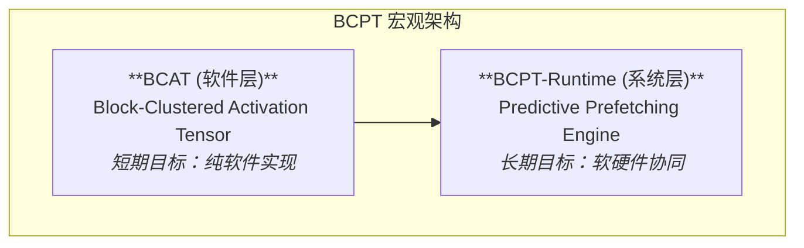

# BCPT: Block-Compressed Predictive Tensor (v1.1)

> **核心思想**: BCPT 是一个**软硬件协同的计算与存储架构**。其目标是通过**预测性地**将模型权重中即将被激活的**稠密块**加载到高速缓存中，来从根本上解决现代深度学习中“激活稀疏 vs. 权重稠密”所导致的随机访存瓶颈。

## 1. 核心困境：激活稀疏 vs. 权重稠密

`Tiny-ONN` 的核心范式 (`MoIE`/`SBL`) 是一种**激活稀疏**模型：

- **权重稠密**: 权重矩阵（如 `SBL` 中的 `mu_weight`）是物理上完全稠密的，它是一个连续的知识空间。
- **激活稀疏**: 对于任意输入，只有一个动态的、数据驱动的、非结构化的稀疏子集被“激活”用于计算。

这导致了一个现有框架无法解决的根本矛盾：对一个**物理上稠密的张量**，进行**逻辑上稀疏的、不规则的**动态索引。这在冯诺依曼架构下会转化为灾难性的随机内存访问。

## 2. 现有稀疏方案的形式化分析与排除

在我们之前的工作中，我们对 PyTorch 现有的稀疏格式进行了全面的形式化分析，结论是**它们均不适用**。

- **`COO` (坐标格式)**: 将矩阵视为无结构的“点集”。
  - **致命缺陷**: 灾难性的索引开销（每个 `bfloat16` 值需 `2 * int64` 索引）和 Autograd 在处理海量离散梯度时导致的显存爆炸。它在存储、计算和内存管理上均失败。
- **`CSR`/`CSC` (压缩行/列)**:
  - **致命缺陷**: 索引压缩不充分，且动态构建开销过高。它依然未能解决“碎片化索引”的核心问题，不适用于 `SBL` 的在线、动态特性。
- **`BSR`/`BSC` (块稀疏)**:
  - **致命缺陷**: 过于僵化。它要求稀疏性以**固定的、预定义的块**形式存在，与 `SBL` 涌现的、非结构化的细粒度激活模式存在根本性冲突。
- **`FlexAttention` (序列块稀疏)**:
  - **致命缺陷**: 解决了不同的问题。它优化的是**注意力矩阵 `(N_seq, N_seq)` 上的序列稀疏**，而我们的问题是**权重矩阵 `(D_in, D_out)` 上的激活稀疏**。

> **最终裁定**: 现有方案要么过于灵活导致性能灾难，要么过于僵化无法适应动态模式。从头设计一个为 `SBL` 量身定制的解决方案是唯一正确的道路。

## 3. BCPT 架构：分层的解决方案

BCPT 是一个分层的架构，包含了从纯软件到软硬件协同的完整路径。

### 3.1. BCAT: 软件层面的“在线碎片整理”

**BCAT (Block-Clustered Activation Tensor)** 是 BCPT 在纯软件层面的实现，也是我们的**短期核心目标**。它是一种特殊的张量**数据结构**和与之关联的**计算策略**。

- **核心设计**: 一个高效的**在线聚类/碎片整理算法**。该算法在每次前向传播时，接收 `SBL` 生成的逻辑稀疏激活矩阵 (`raw_weights`)，并将其动态地、近似地分解为一组最优的稠密计算块。

- **数据结构**: 一个 `BCAT` 张量由两部分组成：
  1. **`block_meta`**: 一个形状为 `(num_blocks, 4)` 的 `int` 张量，存储每个稠密块的 `(row_start, col_start, row_len, col_len)`。
  2. **`block_values`**: 一个包含 `num_blocks` 个稠密张量的列表或拼接后的一维张量，存储所有非零块的实际值。

- **计算范式**: `SBL` 的前向传播将被重构为：
  1. **逻辑激活生成**: 照常计算得到逻辑稀疏的 `raw_weights` 矩阵。
  2. **在线聚类**: `BCAT.cluster(raw_weights)` -> 生成 `block_meta` 和 `block_values`。
  3. **分块计算**: 在 GPU 上并行地对 `block_values` 中的每一个稠密块，执行与 `mu_weight` 相应切片的高效稠密计算。这对于 Autograd 极其友好。

### 3.2. BCPT-Runtime: 系统层面的“预测性加载”

这是我们的**长期愿景**，它建立在 `BCAT` 的成功之上。

- **核心任务**: 将 `BCAT` 识别出的“热点块”信息，转化为对底层硬件的**预取指令 (Prefetch Hints)**。
- **工作流程**:
  1. **热点预测**: `BCPT-Runtime` 监控由 `BCAT` 产生的 `block_meta` 序列，并结合模型的 `PI-Score` 等内部状态，预测未来可能需要的权重块。
  2. **预测性加载**: `Runtime` 向系统驱动发出指令，将预测出的权重块从慢速存储（SSD/RAM）异步地加载到 GPU 的高速缓存（HBM）中。
  3. **计算执行**: GPU 在已预取到 HBM 的稠密权重块上，执行由 `BCAT` 调度的高度优化的 `block-GEMM` 计算。
  4. **元数据更新**: 计算完成后，`Runtime` 更新所有相关物理权重块的访问频率、时间戳等元数据，为下一次预测提供更准确的信息。

## 4. 为什么这是正确的道路？

- **硬件友好**: 基于**块**的操作完美对齐了现代硬件的缓存架构，是战胜“内存墙”的唯一务实路径。
- **短期可行**: `BCAT` 可以在纯 PyTorch/Triton 中实现，为我们提供了一条**立即可行**的性能优化路径，解决了当前 `COO` 格式的显存灾难。
- **哲学统一**: 整个系统的调度最终由涌现出的热点模式驱动。这是**神经达尔文主义在硬件架构层面的体现**。
