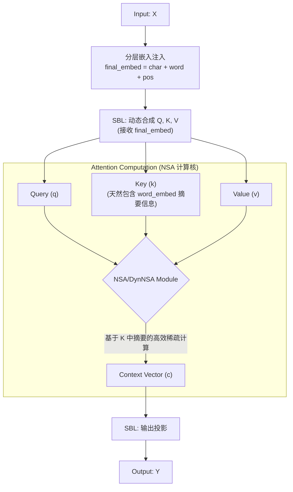

# DynNSIHA

## 1. 核心思想：极致稀疏的动态注意力机制

`DynNSIHA` 是为 `Tiny-ONN` 项目设计的下一代注意力机制。它旨在解决一个核心的架构困境：如何在保持 `DynSIHA` 强大的理论表达能力（动态函数合成）的同时，尽可能克服其在当前硬件上因“伪稠密”计算而产生的高昂性能开销。

该架构的核心思想，是将两种看似冲突的稀疏化方案进行一次深度、互补的融合：

1. **`DynSIHA` (Dynamic Sparse Infinite-Head Attention)**: 提供**理论上的优雅**。它通过 `SBL` (稀疏贝叶斯层) 为每个 token 动态地、内容感知地合成专属的 QKV 投影函数，实现了神经元级别的、涌现式的软性稀疏。
2. **`NSA` (Native Sparse Attention)**: 提供**工程上的可行性**。它利用硬件友好的计算模式（如分块 Top-K 选择），在宏观块级别上高效地执行稀疏计算。

`DynNSIHA` **并非**一个简单的两阶段过滤系统，而是一个统一的、协同工作的整体。其本质是：**在 `DynSIHA` 动态合成的高质量、富含信息的 QKV 表征之上，应用 `NSA` 高效的稀疏计算核，从而实现理论表达力与硬件性能的统一。**

---

## 2. 架构设计：Word-Guided DynNSIHA

`DynNSIHA` 的优雅之处在于，它与我们 `Omni-Modal` 架构中的“分层嵌入注入”方案产生了深刻的共鸣，找到了一个天然的、无成本的“摘要”机制。

### 2.1. `forward` 流程详解

1. **输入层 (语义摘要的注入)**:

   - 模型接收的原始输入 `X` 首先经过“分层嵌入注入”处理。
   - `word_embed` 在这一步就为每个 token 注入了其所属词汇的语义信息。这**天然地**构成了 `NSA` 所需的**语义摘要 (Semantic Summary)**，完全取代了原版 `NSA` 中需要额外 `compress_mlp` 来计算的笨拙设计。

2. **QKV 动态合成**:

   - `sbl_qkv` 模块接收包含了 `word_embed` 摘要信息的 `final_embed` 作为输入。
   - 它为每个 token 动态地合成出专属的 `q`, `k`, `v` 向量。此时的 `k` 向量已经是一个高质量的、同时编码了字符级细节和词级语义的混合表征。

3. **注意力计算 (NSA 计算核)**:

   - 标准的 `scaled_dot_product_attention` 被一个 `NSA` (或其动态版本 `DynNSA`) 模块取代。
   - **重要性评分**: `NSA` 在计算 `q` 和 `k` 的点积以决定块重要性时，实际上是在评估一个包含了细粒度匹配和高层语义相似度的综合分数。`word_embed` 的存在使得这个评分过程更加准确和鲁棒。
   - **稀疏执行**: `NSA` 在由 `word_embed` 引导选出的 Top-K 关键块上，执行其高度优化的、硬件友好的稀疏注意力计算。

4. **输出投影**:
   - 注意力计算得到的上下文向量 `c` 被送入 `sbl_o` 模块，进行最终的动态输出投影。

### 2.2. 关键优势

- **架构统一**: 移除了 `NSA` 中孤立的 `compress_mlp`，使其功能被 `Omni-Modal` 架构中更基础的 `word_embed` 组件完美取代，提升了整体架构的自洽性和优雅性。
- **计算前置**: 将“摘要”的生成从模型深层的昂贵 `MLP` 计算，前置到了模型入口处高效的 `nn.Embedding` 查找，极大地优化了性能。
- **端到端协同**: `word_embed` 本身是端到端可学习的，这意味着模型会自动学习如何生成对后续稀疏注意力计算最“有用”的语义摘要，实现了输入表征与注意力计算的深度协同。
- **保留双方优点**: 既保留了 `DynSIHA` 强大的动态函数合成能力，又利用了 `NSA` 硬件友好的计算核来解决性能瓶颈，实现了理论与实践的完美结合。
