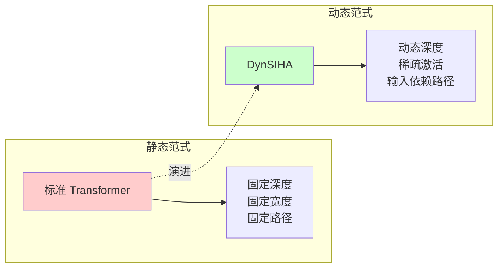
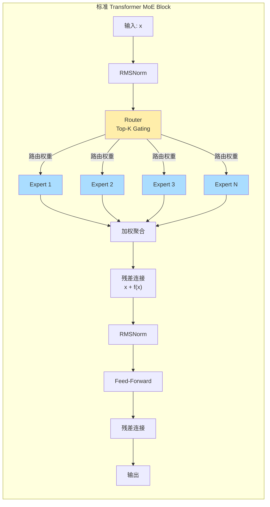
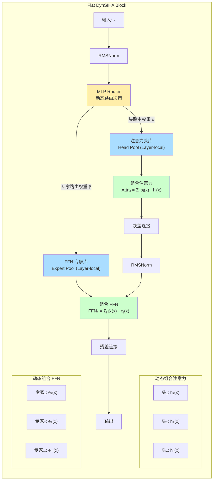
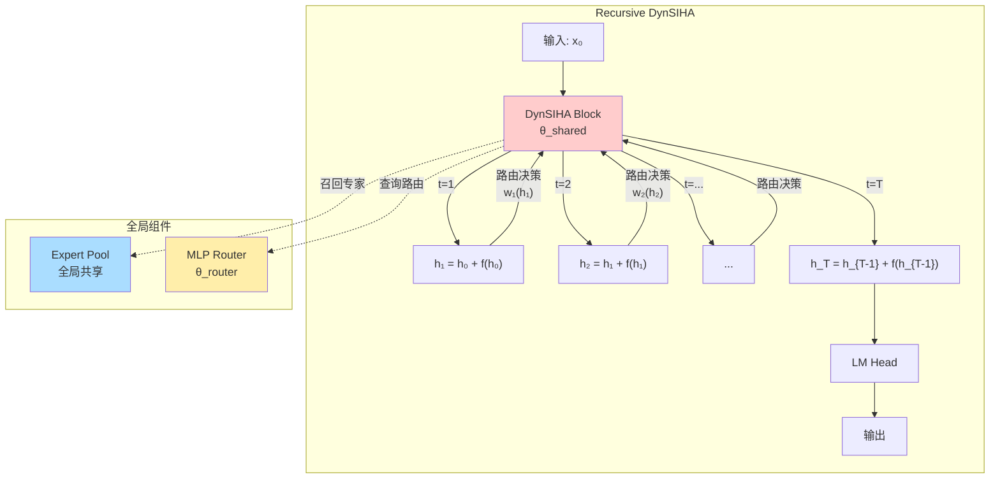
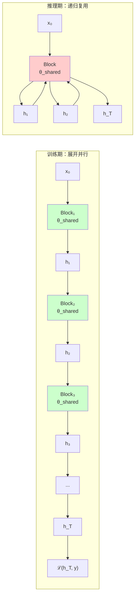

# DynSIHA: Dynamic Sparse Infinite-Head Attention

> 生命的本质，是用内在的确定性，对抗外部的不确定性。
>
> —— 林睿，于 2025 年 10 月

本文档旨在对 DynSIHA (Dynamic Sparse Infinite-Head Attention) 及其核心理念进行形式化梳理与重构。

## 开幕：第一印象

在梯度的流动中，架构的选择决定了信息如何被加工。让我们用一组工业隐喻来理解这种差异：

### 传送带范式

**传统 RNN** 是一条环形传送带：货物（信息）在固定的轨道上循环流动，经过同一个加工站反复处理。它无法并行，因为每一步都依赖前一步的完整输出。

**Transformer** 是多段并行传送带：将流程切分为固定数量的工段，每段内部可以并行处理。但段数一旦设定便不可更改——无论货物简单或复杂，都必须经过全部工段。

**Universal Transformer** 是另一种环形传送带：虽然每段都是并行循环，但轨道依然固定。货物反复经过同一个并行加工站，直到满足某个停止条件。

### 塔吊范式

**DynSIHA** 是一座塔吊：

- **共享基座**：所有构件（专家）存储于全局仓库，而非绑定于特定层级
- **自展开臂架**：每一步都在之前搭建的结构上增量组装新的"逻辑层"
- **动态配重**：根据当前货物的语义特征，实时从仓库调配合适的构件组合

## 技术选型摘要

### 为什么不是静态 Transformer？

标准 Transformer 是计算图拓扑的**静态承诺**：在训练开始前，网络的深度、宽度、连接模式已被超参数锁定。无论输入是简单的模式补全还是复杂的多步推理，模型都被迫走过相同的计算路径。

这种静态性在 ARC（Abstraction and Reasoning Corpus）任务中暴露致命缺陷：

- **异构复杂度**：ARC 样本的 Kolmogorov 复杂度跨越数个数量级，从简单的颜色映射到复杂的几何变换
- **离散逻辑**：符号推理需要精确的非线性决策边界，线性路由无法表达 XOR 类的逻辑组合
- **最小描述长度（MDL）原则**：简单任务不应支付深层网络的计算税

### 动态函数合成（Dynamic Function Composition, DFC）

DynSIHA 的核心范式转移：从 `y = f(x; θ)` 到 `y = fₓ(x; θ)`。

函数 `f` 本身成为输入 `x` 的函数。每一层不再是固定的特征变换，而是根据输入语义动态组装的**逻辑层（Logic Layer）**——由路由器从全局专家仓库中召回最适合当前推理步骤的专家组合，实时合成计算图。

这带来三重优势：

1. **计算-推理解耦**：训练期保持计算稠密（GPU 友好），推理期实现路径稀疏（认知高效）
2. **非线性表达能力**：MLP 路由提供完整的非线性决策边界，对离散逻辑任务至关重要
3. **深度自适应**：通过 PLSD 实现任务复杂度与计算深度的帕累托最优

### 架构演进路线



---

## 第一部分：总体模块架构

### 1.1 标准 Transformer MoE 架构

作为参照基线，标准 MoE Transformer 的模块架构如下：



**关键特征**：

- **层级堆叠**：物理上存在 L 个独立的 Block，每层拥有独立参数
- **静态路由**：路由器仅根据当前层输入做局部决策，无跨层协调
- **固定深度**：无论输入复杂度，所有样本遍历全部 L 层

### 1.2 Flat DynSIHA（FDS）架构

FDS 是 DynSIHA 的层级化实现，保留 Transformer 的堆叠结构，但在每层内部实现**动态组合注意力+MoE**系统。与 RDS 的全局共享仓库不同，FDS 的每层拥有独立的注意力头和专家库：



**核心特征：层内动态组合系统**

FDS 的每层都是一个独立的动态函数合成单元，包含两个并行的路由决策：

1. **注意力头路由**：选择并组合当前层内的注意力头

   ```
   Attnₓ(x) = Σᵢ₌₁ⁿ αᵢ(x) · AttentionHeadᵢ(x)
   ```

2. **FFN 专家路由**：选择并组合当前层内的 FFN 专家

   ```
   FFNₓ(x) = Σⱼ₌₁ᵐ βⱼ(x) · Expertⱼ(x)
   ```

**与标准 MoE 及 RDS 的关键差异**：

| 维度 | 标准 MoE | Flat DynSIHA (FDS) | Recursive DynSIHA (RDS) |
|:---|:---|:---|:---|
| **路由架构** | 线性/余弦相似度 | MLP 非线性 | MLP 非线性 |
| **注意力机制** | 固定多头 | **动态组合注意力** | 动态组合注意力 |
| **专家组织** | 层内隔离 | **层内独立仓库** | 全局共享仓库 |
| **跨层共享** | 无 | 无 | **权重绑定** |
| **负载均衡** | 频率均匀化 | FARS 认知代价感知 | FARS 认知代价感知 |
| **路由稳定性** | 无显式约束 | SAME 谱感知更新 | SAME + SIA |

### 1.3 Recursive DynSIHA（RDS）架构

RDS 是 DFC 理念的终极形态。物理上只存在一个递归块，但在时间上展开为 T 个逻辑层：



**核心对应关系**：

| RDS 组件 | 标准 Transformer | Universal Transformer |
|:---|:---|:---|
| **递归块** | L 个独立 Block | 单个 Block，T 次展开 |
| **时间步 t** | 层索引 l | 递归深度 t |
| **权重绑定** | 层间独立 | 跨时间共享 θ_shared |
| **路由决策** | 每层独立 | 每步动态 wₜ(hₜ) |
| **残差连接** | xₗ = xₗ₋₁ + f(xₗ₋₁) | hₜ = hₜ₋₁ + f(hₜ₋₁) |

**关键原则：拒绝步长偏置**

RDS 的路由决策**严禁引入 Step Embedding**。无论处于第几层，召回专家的逻辑应当保持语义一致性。强制感知层数会破坏模型自适应决定"处理什么"的能力，将其退化为预设的固定路径。

路由的稳定性不是通过架构偏置实现，而是通过**FARS 路由塑造**和**SIA 协同逻辑对齐**在训练动态中强制涌现。

---

## 第二部分：路由设计

### 2.1 MLP 路由：非线性决策的必要性

标准 MoE 广泛采用线性路由（如余弦相似度、点积注意力）：

```
w = Softmax(W · x)  # 线性投影 + softmax
```

这种线性路由在离散逻辑任务中存在**表达能力瓶颈**：

- **XOR 问题**：线性分类器无法分离 XOR 决策边界
- **多模态语义**：相似输入可能需要路由到不同专家（如"红色"在"复制"vs"镜像"任务中的不同处理）
- **上下文依赖**：路由决策需要整合全局上下文，而非仅基于当前 token 表征

**MLP 路由提供完整的非线性表达能力**：

```
w = Softmax(MLP(x)) = Softmax(W₂ · SiLU(W₁ · x + b₁) + b₂)
```

对于 ARC 这类离散符号推理任务，路由决策本身就是**逻辑表达**——MLP 路由能够学习复杂的、上下文相关的专家召回策略，这是线性路由无法实现的。

### 2.2 路由塑造：Fisher Aware Load Balance / Network Curvature Control

MLP 路由的表达能力带来**稳定性挑战**：非线性函数更容易过拟合，路由决策可能随训练剧烈漂移。DynSIHA 通过**路由塑造（Routing Shaping）**解决这一问题。

#### 2.2.1 FARS：Fisher-Aware Routing Shaping

FARS 利用优化器二阶矩（Fisher 信息近似）量化专家的"认知代价"，驱动路由实现智能负载均衡。

**核心洞察：梯度-路由对偶性**

主任务梯度天然携带样本级的重要性信息。FARS 将专家的认知代价定义为：

```
Cost_FARS(e) = ‖√vₑ‖
```

其中 `√vₑ` 是 ARS2-Neo 优化器维护的专家参数二阶矩（Fisher 信息对角近似）。高 Cost 表示专家参数更新剧烈、局部曲率大、过拟合风险高。

**路由塑造信号**：

```
𝒢 = Belief · Cost_FARS
```

- `Belief = P(e|x;φ)`：路由器的 softmax 输出
- `Cost_FARS`：专家的认知复杂度

总路由损失：

```
ℒ_routing = ℒ_main + λ · (Belief · Cost_FARS)
```

**效用-代价平衡**：

- **效用项（∇ᵩ ℒ_main）**：包含样本特异性，驱动路由器选择对当前样本重要的专家
- **代价项（λ · Cost）**：提供全局背景阻力，抑制选择认知压力大的专家

这种平衡等价于在**认知预算约束**下的信息熵最大化（IELB），自然导向帕累托最优的负载分布。

#### 2.2.2 SAME：谱感知更新（Network Curvature Control）

FARS 解决专家级负载均衡，SAME 解决路由器自身的**漂移问题**。

**双漂移问题**：

1. **Router Drift**：路由器参数漂移导致历史输入被重新分配到不同专家
2. **Expert Drift**：专家自身参数被新任务覆盖，丧失历史功能

**谱感知路由机制**：

SAME 维护路由器输入的协方差矩阵：

```
Cₜ = E[x xᵀ]
```

通过 SVD 分解识别子空间：

```
Cₜ = U Σ Vᵀ
V∥ = 高能量子空间（当前任务主要变化方向）
V⊥ = 近似零空间（历史任务稳定方向）
```

**梯度投影更新**：

```
ΔW∥ = ΔW_G · V∥ · g(Σ) · V∥ᵀ   # 任务相关方向，允许更新
ΔW⊥ = ΔW_G · V⊥ · V⊥ᵀ           # 历史保护方向，最小干扰
```

其中 `g(Σ) = diag(α₁σ₁, ..., αᵣσᵣ)`，`αᵢ = 1/σ̂ᵢ` 实现奇异值缩放。

**关键性质**：在零空间 `V⊥` 中的更新满足 `V⊥ᵀ · x_old ≈ 0`，因此不会改变历史输入的路由决策。

#### 2.2.3 FARS 与 SAME 的协同

| 机制 | 目标 | 作用层级 | 数学工具 |
|:---|:---|:---|:---|
| **FARS** | 专家负载均衡 | 专家选择概率 | Fisher 信息近似 `√v` |
| **SAME** | 路由决策稳定 | 路由器参数更新 | 协方差矩阵谱分解 |

两者互补：FARS 确保专家被智能使用，SAME 确保路由器本身不漂移。

---

## 第三部分：RDS 残差连接与展开训练

### 3.1 递归即层级：权重绑定的深度演化

RDS 不应被视为简单的 RNN，而应被视为**在训练时展开为权重绑定的深层网络**。

**形式化定义**：

```
hₜ = hₜ₋₁ + DynSIHABlock(hₜ₋₁; θ_shared)
```

其中 `DynSIHABlock` 包含：

- 动态路由：`wₜ = Router(hₜ₋₁)`
- 专家召回：`eₜ = ExpertPool[wₜ]`
- 函数合成：`f(hₜ₋₁) = Σᵢ wₜ,ᵢ · expertᵢ(hₜ₋₁)`

**与标准 Transformer 的对应**：

| 概念 | 标准 Transformer | RDS |
|:---|:---|:---|
| 层 | L 个物理层 | T 个逻辑时间步 |
| 参数 | θ₁, θ₂, ..., θ_L | θ_shared（绑定） |
| 残差 | xₗ = xₗ₋₁ + fₗ(xₗ₋₁) | hₜ = hₜ₋₁ + f(hₜ₋₁) |
| 梯度流 | 层间独立 | 时间展开，BPTT 或 SIA |

### 3.2 展开为 FDS-like：并行化训练

RDS 的递归特性在训练时带来挑战：顺序计算无法利用 GPU 的并行性。解决方案是**将 RDS 展开为 FDS-like 结构进行并行训练**。

**展开原理**：

在训练阶段，将单个递归块物理复制 T 次，形成展开的计算图：

```
输入 x₀
↓
Block₁(θ_shared) → h₁ = x₀ + f(x₀; θ_shared)
↓
Block₂(θ_shared) → h₂ = h₁ + f(h₁; θ_shared)
↓
...
↓
Block_T(θ_shared) → h_T = h_{T-1} + f(h_{T-1}; θ_shared)
```

**关键约束**：所有 Block 共享同一组参数 `θ_shared`，梯度更新时累加所有时间步的梯度：

```
∇θ = Σₜ₌₁ᵀ ∇θ ℒ(hₜ, y)
```

**并行化实现**：



### 3.3 训练-推理一致性

| 阶段 | 计算图 | 参数共享 | 梯度更新 |
|:---|:---|:---|:---|
| **训练** | 展开为 T 个 Block | 物理复制，逻辑共享 | SIA 叠加梯度 |
| **推理** | 单个 Block 递归 T 次 | 物理共享 | 无梯度 |

这种设计确保：

1. **训练效率**：展开并行化利用 GPU 吞吐量
2. **推理效率**：权重绑定大幅减少参数量和内存占用
3. **动态深度**：推理时可通过 PLSD 实现自适应早停

---

## 第四部分：PLSD 取代 Q-Learning

### 4.1 自适应计算时间（ACT）的使命

在静态范式中，模型深度 T 是超参数。但任务的 Kolmogorov 复杂度 `K(x)` 是动态的。

**ACT 的核心问题**：寻找映射 `t = φ(x)`，使计算资源与任务难度实现帕累托最优。

### 4.2 Q-Learning-ACT 的局限

早期 TRM 采用 Q-Learning 实现 ACT：

```
状态：hₜ（当前隐藏表征）
动作：{Halt, Continue}
奖励：仅在停止步给出，基于最终预测准确性
```

**核心局限**：

1. **信号稀疏**：只有停止步获得真实 Loss 信号，中间步骤"盲飞"
2. **训练不稳定**：Q-learning 的不稳定性在递归架构中被放大
3. **非单调性**：递归过程的 Loss 并不总是单调下降，Q-learning 难以捕捉震荡地形

### 4.3 PLSD 的引入与自适应逻辑

PLSD 放弃了强化学习的探索范式，转向基于全量观测的自监督对齐。详细的形式化定义与泛化假设请参考 [`PLSD.md`](.roo/rules/PLSD.md)。

**RDS 与 PLSD 的天然契合点**：

RDS 的权重绑定递归架构为 PLSD 提供了完美的物理基础。在标准 Transformer 中，层间参数独立导致每层解码的语义空间不一致；而 RDS 的每一步都在**同一个动态 Block** 中执行，通过路由动态组装逻辑层。

这意味着：
- **语义一致性**：每一步的输出 $h_t$ 都在相同的表征协议下，可以直接共享解码头。
- **认知饱和度量**：Oracle 步长 $t^*$ 不仅仅是一个停止信号，更是系统在当前参数流形下对该样本认知能力的极限度量。
- **MDL 兼容性**：在 [`ARS2-Neo`](ref/ARS/README_CN.md) 的平坦度约束下，PLSD 能够引导模型识别出解决任务的“最短逻辑路径”。

### 4.4 综合训练目标

在 DynSIHA 框架下，系统通过以下联合损失函数实现认知几何、计算架构与目标分布的统一对齐：

```
ℒ_total = ℒ_main + λ_FARS · ℒ_FARS + λ_ACT · ℒ_ACT
```

1. **主任务损失 ($\mathcal{L}_{main}$)**：在 Oracle 步 $t^*$ 处的解码损失，确保最佳认知点的预测精度。
2. **路由塑造损失 ($\mathcal{L}_{FARS}$)**：基于 Fisher 信息的专家认知代价约束。
3. **深度对齐损失 ($\mathcal{L}_{ACT}$)**：使停止头拟合 $t^*$ 阈值的自监督信号。

---

## 附录：概念速查

| 术语 | 定义 | 所在章节 |
|:---|:---|:---|
| **DFC** | Dynamic Function Composition，动态函数合成 | 技术选型摘要 |
| **FDS** | Flat DynSIHA，层级化 DynSIHA 实现 | 1.2 |
| **RDS** | Recursive DynSIHA，递归化 DynSIHA 实现 | 1.3 |
| **FARS** | Fisher-Aware Routing Shaping，Fisher 感知路由塑造 | 2.2.1 |
| **SAME** | Spectral-Aware Mixture-of-Experts，谱感知专家混合 | 2.2.2 |
| **IELB** | Information Entropy Load Balancing，信息熵负载均衡 | 2.2.1 |
| **SIA** | Synergistic Invariant Alignment，协同不变对齐 | 3.2 |
| **PLSD** | Per-Layer Speculative Decode，逐层推测解码 | 第四部分 |
| **t*** | Oracle 步长，认知饱和点 | 4.3 |
