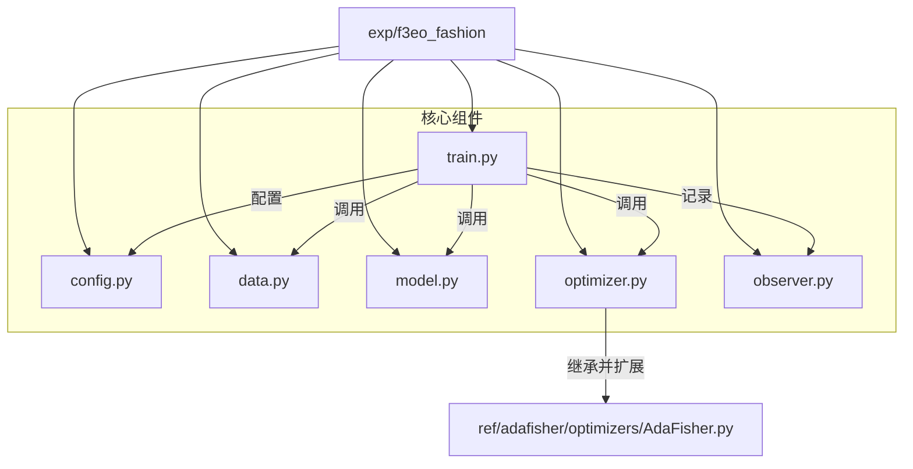

# F3EO 在 FashionMNIST 上的基准测试实验计划

**版本**: 0.1.0
**日期**: 2025-11-02
**所有者**: Tiny-ONN 课题组

## 1. 目标与范围

### 1.1. 核心目标

本项目旨在对 **F3EO (Fast Fisher-FreeEnergy Optimizer)** 的有效性进行初步的、可控的基准测试。实验将分为两个阶段：首先（Phase 0）验证模型架构的合理性，然后（Phase 1）在此架构上对比 F3EO、AdaFisher 和 AdamW 三种优化器的性能，以验证“三阶优化”思想。

### 1.2. 核心假设

通过最小化一个代表模型复杂度的元损失 `L_meta`（该损失是 Fisher 信息矩阵 `ℱ` 的函数），F3EO 能够主动重塑参数空间的几何结构，从而比传统的一阶和二阶优化器获得更快的收敛速度和/或更高的最终性能。

### 1.3. 实验范围与路径

- **数据集**: FashionMNIST
- **对比优化器**:
    1. `AdamW` (一阶基线)
    2. `AdaFisher` (二阶基线)
    3. `F3EO` (三阶实验组)
- **产出**: 包含损失和准确率对比的图表和分析报告。
- **实验路径**:
    1. **Phase 0 (前置实验)**: 快速验证**Baseline Architecture**。对比“标准Transformer”与“FFN-in-MHA”两种架构在FashionMNIST上的性能，以确定后续优化器测试所使用的最终模型结构。
    2. **Phase 1 (主实验)**: 在 Phase 0 确定的架构上，运行 F3EO、AdaFisher 和 AdamW 的完整对比实验。

---

## 2. 架构与代码结构

新的实验将遵循项目现有的模块化结构，创建 `exp/f3eo_fashion` 目录。



### 2.1. 文件职责

- **`config.py`**: 集中管理所有超参数，包括学习率、batch size、训练轮次、优化器参数（如 `beta`, `lambda`），以及 F3EO 特有的 `L_meta` 相关超参数。
- **`data.py`**: 负责下载、预处理和加载 FashionMNIST 数据集，提供标准的 `DataLoader`。
- **`model.py`**:
  - 定义一个极简的 **`FFN-in-MHA`** 模型。
  - 该模型将图像展平 (flatten) 为序列，通过一个 `Embedding` 层，然后输入一个 `MultiheadAttention` 层。
  - **关键设计**: 注意力头内部不再使用标准的 `nn.Linear` 进行 `in_proj` 和 `out_proj`，而是使用一个**普通的两层 MLP**。
  - 这个 MLP 将作为一个纯粹的非线性变换，其表达能力远超线性投影，从而将 FFN 的功能直接包含在注意力头中。
  - **研究背景**: 初步的文献调研（`tavily` 搜索）未发现直接采用此“FFN-in-MHA”设计的公开研究，表明该架构本身具有一定的探索性和新颖性。
  - MHA 的输出（`class token` 或全局平均池化）直接通过一个最终的 `Linear` 层进行分类。
- **`optimizer.py`**:
  - **核心实现文件**。
  - 定义 `F3EO` 类，它将**继承**自 `AdaFisher`。
  - 在 `step()` 方法的末尾，它将额外计算 `L_meta` 损失。
  - 通过 `L_meta.backward()` 计算出对模型参数 `θ` 的三阶梯度。
  - 将此三阶梯度**直接应用**到参数上，或与优化器内部状态结合。
- **`train.py`**:
  - 实验的主入口。
  - 负责初始化模型、数据加载器和指定的优化器（AdamW, AdaFisher, 或 F3EO）。
  - 执行标准的训练和评估循环。
  - 调用 `Observer` 记录关键指标。
- **`observer.py`**:
  - 负责记录每个 `step` 或 `epoch` 的训练/验证损失和准确率。
  - 实验结束后，生成对比图表并保存。

---

## 3. F3EO 实现策略

### 3.1. 继承 `AdaFisher`

F3EO 的实现将严格建立在 `AdaFisher` 的二阶优化能力之上。`F3EO` 类将继承 `AdaFisher`，从而复用其计算 `H_D` 和 `S_D` 并近似 Fisher 矩阵 `ℱ` 的所有机制。

### 3.2. `L_meta` 的计算

在第一阶段，我们将实现计算最简单的 `L_meta` 候选：

1. **迹最小化 (Trace Minimization)**: `L_meta = Tr(ℱ_block)`
2. **Frobenius 范数 (Frobenius Norm)**: `L_meta = ‖ℱ_block‖_F²`

`AdaFisher` 已经将 `H_D` 和 `S_D` 作为其内部状态存储。我们可以直接访问这些向量来计算 `L_meta`，而无需重新计算或执行昂贵的矩阵操作。

### 3.3. 三阶梯度的应用

`F3EO.step()` 的伪代码如下：

```python
class F3EO(AdaFisher):
    def step(self, closure=None):
        # 1. 执行标准的 AdaFisher (二阶) 更新
        super().step(closure)

        # --- F3EO 三阶更新开始 ---
        # 2. 清空梯度，为计算三阶梯度做准备
        self.zero_grad() 

        # 3. 计算 L_meta
        #    需要一个辅助函数，能从 self.H_D 和 self.S_D 计算出 L_meta
        l_meta = self.calculate_l_meta()

        # 4. 反向传播，得到对模型参数 θ 的三阶梯度
        #    这里需要 careful handling of the graph
        l_meta.backward()

        # 5. 应用三阶梯度
        #    直接用一个小的学习率 lr_meta 来应用这个梯度
        with torch.no_grad():
            for p in self.model.parameters():
                if p.grad is not None:
                    p.add_(p.grad, alpha=-self.lr_meta)
        
        # 6. 再次清空梯度，避免干扰下一步的主任务梯度计算
        self.zero_grad()
```

此计划是否清晰？您是否预见到任何风险？
