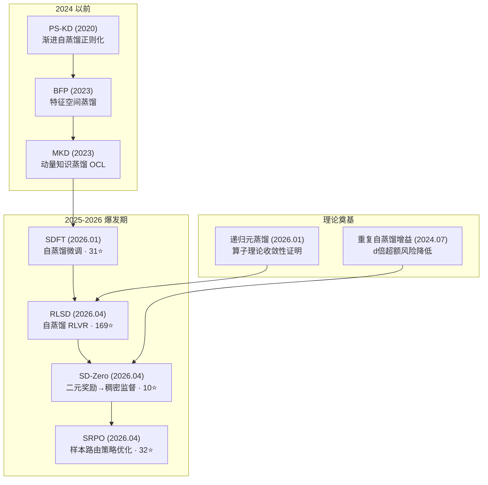
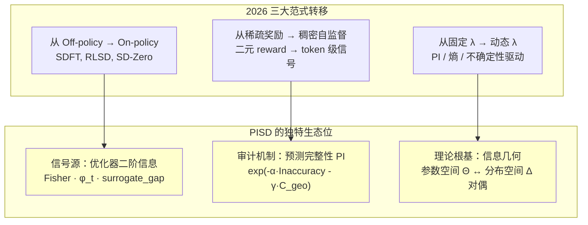

# 自蒸馏在持续学习中的最新发展：一项 HF Papers 调查

> *"当学界 all in RL scaling 时，我们总得坚守真理。"*

---

## 一、总体态势：2026 年是自蒸馏持续学习的爆发年

从搜索结果来看，**2026 年 1-4 月间涌现了大量将自蒸馏应用于持续学习/终身学习的高影响力工作**。这并非巧合——当 RL scaling 路径在 GRPO/RLVR 范式下趋于成熟，学界开始重新审视一个根本问题：**稀疏奖励信号是否足以支撑模型在多任务流中的稳定知识积累？** 自蒸馏提供的稠密 token 级监督，正在成为回答这一问题的关键拼图。

---

## 二、核心论文逐篇分析

### 2.1 🥇 SDFT：Self-Distillation Fine-Tuning（2026.01）

> **Shenfeld, Damani, Hübotter, Agrawal** · [2601.19897](https://hf.co/papers/2601.19897) · 31⭐ · 6 条讨论

**核心贡献**：将自蒸馏从"正则化技巧"升级为**持续学习的独立训练范式**。

- **机制**：利用 demonstration-conditioned model 作为自身的 teacher，生成 on-policy 训练信号
- **关键洞察**：SFT 是 off-policy 的——模型在旧数据上训练，在新数据上评估，天然导致分布偏移和遗忘。SDFT 通过 in-context learning 使模型在**当前策略**下自我教学
- **实验结果**：在技能学习和知识获取任务上，SDFT 一致优于 SFT，显著降低灾难性遗忘

**与 PISD 的关联**：
SDFT 的 `q_mix = (1-λ)y + λ·p_θ` 结构与 PISD 的混合目标形式完全一致。但 SDFT 的 λ 是固定的或启发式调节的，而 **PISD 的核心差异在于 λ 由预测完整性 PI 动态驱动**——这正是 SDFT 所缺失的"何时该信任内部先验"的审计机制。

---

### 2.2 🔥 RLSD：RLVR with Self-Distillation（2026.04）

> **Yang et al.** · [2604.03128](https://hf.co/papers/2604.03128) · **169⭐** · 5 条讨论

**这是目前最受关注的工作**，169 个 upvote 说明社区对此方向的高度认可。

**核心贡献**：揭示了 on-policy self-distillation (OPSD) 的**信息泄露问题**，并找到了自蒸馏在 RL 中的最优生态位。

- **问题诊断**：当 teacher 获得 privileged information（如参考答案）时，自蒸馏信号会泄露 ground truth，导致训练不稳定
- **解决方案 RLSD**：
  - **更新方向**：由 RLVR 的环境反馈（response correctness）决定——可靠但稀疏
  - **更新幅度**：由自蒸馏的 token 级策略差异决定——稠密但不可靠
  - 两者解耦，各司其职

**与 PISD 的深层共鸣**：
RLSD 的核心发现——"纯粹的自蒸馏信号会导致信息泄露和不稳定"——**直接验证了 PISD 的设计哲学**。PISD 中的 `λ_max = 0.9` 硬上界和 PI 审计机制，正是为了防止模型陷入"认知茧房"。RLSD 从 RL 角度得出了相同的结论：自蒸馏需要外部锚定。

---

### 2.3 💡 SD-Zero：Self-Distillation Zero（2026.04）

> **He et al.** · [2604.12002](https://hf.co/papers/2604.12002) · 10⭐ · 3 条讨论

**核心贡献**：无需外部 teacher，无需高质量 demonstration，将二元奖励转化为稠密 token 级自监督。

- **Generator-Reviser 双角色架构**：
  1. Generator 生成初始响应
  2. Reviser 基于该响应 + 二元奖励生成改进版本
  3. 将 Reviser 的 token 分布蒸馏回 Generator
- **两个涌现特性**：
  - **Token-level self-localization**：Reviser 能基于 reward 定位 Generator 响应中需要修正的关键 token
  - **Iterative self-evolution**：修正能力的提升可通过定期 teacher 同步蒸馏回生成性能

**与 PISD 的关联**：
SD-Zero 的 "token-level self-localization" 与 PISD 中 PI 对"哪些知识需要保护、哪些可以更新"的细粒度审计在精神上高度一致。区别在于：SD-Zero 用二元 reward 作为外部信号，PISD 用优化器二阶信息（Fisher）作为内部信号。

---

### 2.4 🎯 SRPO：Sample-Routed Policy Optimization（2026.04）

> **Li et al.** · [2604.02288](https://hf.co/papers/2604.02288) · 32⭐ · 3 条讨论

**核心贡献**：揭示了 SDPO（Self-Distillation Policy Optimization）的**晚期训练崩溃**问题，并提出样本级路由解决方案。

- **SDPO 的两个内在缺陷**：
  1. 对已正确样本的自蒸馏引入优化歧义
  2. Self-teacher 的信号可靠性随训练逐步退化
- **SRPO 的路由策略**：
  - 正确样本 → GRPO 的 reward-aligned 强化
  - 失败样本 → SDPO 的 targeted logit-level 修正
  - 熵感知动态加权抑制高熵不可靠蒸馏目标

**与 PISD 的关联**：
SRPO 的"熵感知动态加权"与 PISD 的 PI 驱动 λ 调节本质上是同一思路的两种实现：**根据当前状态的质量动态决定自蒸馏的强度**。SRPO 用熵，PISD 用 Fisher 信息 + 梯度一致性。

---

### 2.5 🔒 IDER：Idempotent Experience Replay（2026.02）

> **Liu et al.** · [2603.00624](https://hf.co/papers/2603.00624)

**核心贡献**：将**幂等性**（idempotence）引入持续学习蒸馏。

- **幂等蒸馏损失**：将当前模型输出反馈到旧 checkpoint，最小化再处理输出与原始输出的距离
- **效果**：同时提升预测可靠性、准确率，减少遗忘
- **可插拔设计**：与现有 CL 方法无缝集成

---

### 2.6 📐 递归元蒸馏：公理化框架（2026.01）

> **Flouro & Chadwick** · [2601.13100](https://hf.co/papers/2601.13100)

**核心贡献**：为递归自蒸馏提供了**严格的数学基础**。

- 将迭代知识蒸馏形式化为概率分布算子序列
- 证明在温和可实现性和凸性假设下，锚定递归蒸馏在 KL 散度下**几何收敛**到 base teacher 分布
- 存在唯一的全局吸引不动点

**对 PISD 的理论支撑**：
这个框架直接回答了"多次自蒸馏是否会累积误差"的问题——在适当的锚定条件下，递归自蒸馏是收敛的而非发散的。PISD 中的 ground-truth 锚定项 `(1-λ_PI)·y` 正是这种"锚定"的工程实现。

---

## 三、趋势总结与 PISD 定位

### 3.1 三条主线

| 主线 | 代表工作 | 核心机制 | 信号源 |
|:---|:---|:---|:---|
| **On-Policy 自蒸馏** | SDFT, RLSD, SD-Zero | 模型作为自身 teacher | 环境反馈 / 二元 reward |
| **动态权重调节** | SRPO, IDER | 根据状态质量调节蒸馏强度 | 熵 / 幂等性 |
| **理论收敛性** | 递归元蒸馏, 重复 SD 增益 | 算子理论 / 超额风险界 | KL 散度收缩 |

### 3.2 PISD 的差异化定位

在上述图景中，**PISD 占据了一个尚未被充分探索的生态位**：

1. **信号源独特性**：所有 2026 年的工作都依赖外部信号（reward、demonstration、参考答案）来驱动自蒸馏。PISD 是唯一使用**优化器内部二阶信息**（Fisher 近似、梯度一致性 φ_t、surrogate_gap）作为置信度信号的方法。这意味着 PISD 不需要任何外部监督即可判断"何时该信任自己"。

2. **信息几何视角**：PISD 将自蒸馏理解为**概率单纯形 Δ 上的扩散算子**，与 SAM 在参数空间 Θ 上的扩散形成对偶——这一理论视角在现有文献中未见对应。

3. **持续学习的原生设计**：大多数 2026 年工作（RLSD、SD-Zero、SRPO）面向的是 LLM 的 post-training 场景，关注单次能力提升。PISD 从设计之初就面向**非平稳数据流中的持续知识积累**，PI 审计机制天然处理 p ∩ q 冲突。

### 3.3 风险与警示

- **RLSD 的信息泄露警告**直接适用于 PISD：若 PI 审计失效，自蒸馏会退化为认知茧房
- **SRPO 的晚期训练崩溃**提示：即使有动态权重，自蒸馏的稳定性需要持续的外部锚定
- **递归元蒸馏的理论**表明：锚定是收敛的必要条件——PISD 的 `(1-λ)y` 项不可丢弃

---

## 四、对 PISD 路线的建议

基于上述调查，PISD 的研究路线可以考虑以下方向：

1. **与 SD-Zero 的 Generator-Reviser 架构融合**：用 PI 替代二元 reward 作为 Reviser 的条件信号，实现完全无外部监督的自我修正
2. **引入 SRPO 的样本级路由**：高 PI 样本走自蒸馏，低 PI 样本走强监督，而非统一混合
3. **利用递归元蒸馏的收敛理论**：为 PISD 的迭代自蒸馏提供收敛性保证的形式化证明
4. **保持差异化**：不要跟风 RLVR + self-distillation 的 LLM 路线，坚守"优化器内部信号驱动"这一独特生态位——这正是"坚守真理"的含义

---

**一句话总结**：2026 年的自蒸馏持续学习正在从 heuristic 走向 principled，从固定权重走向动态调节，从外部监督走向内部信号。PISD 的 PI 驱动机制恰好站在这三条趋势线的交汇点上——但需要警惕 RLSD 和 SRPO 已经揭示的自蒸馏固有风险。
