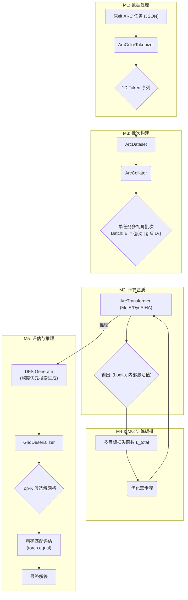

# Tiny-ONN-ARC 工程备忘录

## 系统架构

## 多目标优化

训练过程是一个多目标优化问题，其总损失函数 `L_total` 由三个正交但协同的目标构成：

`L_total = L_task + L_reg + w_sml * L_meta`

1. **任务目标 (Task Objective) `L_task`**: 预测准确性

   - **定义**: 标准的交叉熵损失 `L_task = H(y, p̂)`，其中 `y` 是真实标签，`p̂` 是模型预测。
   - **约束**: **禁止标签平滑 (Label Smoothing)**。此操作会引入噪声，污染元学习目标所需的精确梯度信号。

2. **元学习目标 (Meta-Learning Objective) `L_meta`**: 计算自组织

   - **定义**: 惊奇最小化损失 (Surprise Minimization Loss, SML)。其哲学是：高效的计算应将信息路由至能以最小“系统扰动”处理它的计算单元。
   - **形式化**: "惊奇" `S` 被定义为任务损失 `L_task` 相对于 SBL 层**稠密预计算输出 (`computation_output`)** 的梯度范数：`Sᵢ = ||∇_{aᵢ} L_task||₂`。
   - `L_meta` (`sml_loss`) 的计算方式为 `Σ [-log(S'ᵢ) * S'ᵢ]`，其中 `S'ᵢ` 是经激活率加权的惊奇度。损失的权重 `w_sml` 由模型的不确定性 `τ` 动态调节 (`w_sml = -log(τ)`)。这是一个**高阶梯度 (higher-order gradient)** 优化问题。

3. **正则化目标 (Regularization Objective) `L_reg`**: 自适应可塑性
   - **定义**: 基于 KL 散度的自适应正则化。
   - **形式化**: `L_reg = D_KL( q(W|D) || p(W|τ) )`
     - `q(W|D)`: 权重的后验分布（模型当前状态）。
     - `p(W|τ)`: 一个动态调整的先验分布。其标准差 `prior_std` 由一个**双层动态机制**决定。
   - **机制**:
     - **第一层 (认知不确定性)**: 模型的**瞬时预测不确定性 `τ`** (通过 `logits` 的熵度量) 作为调节可塑性的**目标信号**。高 `τ` 意味着需要高可塑性。
     - **第二层 (结构稳定性)**: 为了防止 `τ` 的短期尖峰对训练造成干扰，我们引入一个由模型**内部结构参数**决定的**动态平滑因子 `β`**，`β = sigmoid(avg_gate - avg_σ)`。
     - **更新规则**: `prior_std` 通过指数移动平均 (EMA) 进行更新：`prior_std_t = β * prior_std_{t-1} + (1 - β) * τ_t`。
       - 当模型结构稳定时 (`avg_gate >> avg_σ`, `β → 1`)，`prior_std` 的更新非常缓慢，表现出强稳定性。
       - 当模型结构剧变或探索时 (`avg_gate ≈ avg_σ`, `β → 0.5`)，`prior_std` 会更快速地跟随 `τ` 的变化，表现出高适应性。

## 工程约束笔记

- **约束 1: 单任务多视角梯度流 (Unitary Task Multi-View Gradient Flow)**

  - **规定**: `batch_size = 1`。训练循环中，单个任务的 8 个 D₈ 对称变换视图被**依次独立处理**，每个视图都执行一次完整的前向和反向传播，如同一个独立的训练步骤。
  - **理论依据**: `L_meta` 的计算依赖于 `L_task` 的梯度。若批次中混合来自不同抽象规则的任务（`T₁`, `T₂`），其 `∇L_task` 信号将相互冲突，产生破坏性的、无意义的“惊奇”度量，从而使门控的自组织过程失效。将多视角作为独立步骤可提供更稳定和多样化的梯度信号。

- **约束 2: 高学习率 (High Learning Rate)**

  - **规定**: 对不同参数组使用差分学习率。基础权重使用较低学习率（`3e-3`），而元参数（`sigma_weight`, `gate_param`）使用更高的学习率（`3e-2`）。
  - **理论依据**: `L_meta` 和 `L_reg` 作用于模型的元参数 (`gate_param`, `sigma_weight`)。这些参数的更新依赖于二阶或更高阶的梯度信息，其梯度信号强度天然弱于一阶的任务梯度。需要足够高的学习率才能有效驱动元参数的学习。

- **约束 3: 禁用梯度检查点 (Gradient Checkpointing Disabled)**

  - **规定**: 必须禁用 `torch.utils.checkpoint.checkpoint`。
  - **理论依据**: 标准的梯度检查点实现通过重新计算前向传播来节省内存，但这会破坏计算图的连续性。`L_reg` 的计算需要回溯 `logits` 的熵对 `prior_std` 进而对权重先验产生影响的复杂依赖路径，检查点会切断 `kl_loss` 到 `sigma_weight` 的梯度流。

- **约束 4: 特定初始条件 (Prescribed Initial Conditions)**
  - **规定**:
    - 后验不确定性 (`sigma_weight`): 从正态分布 `N(2.0, 0.5)` 初始化。
    - 门控阈值 (`gate_param`): 初始化为小的负值 (`-0.1`)。
  - **理论依据**: 自组织系统对初始条件高度敏感。高初始不确定性确保 `L_reg` 在训练早期即有足够信号以激活自适应正则化。微负的门控阈值则允许模型在训练初期进行更广泛的探索，而非过早地强制稀疏。

## 评估：深度优先搜索解码

- **推论**: 在训练过程中，模型通过 D8 数据增强接触了多视角的任务表示，理论上应能学习到任务的内在规则，而不仅仅是表面模式。

- **实现**: 当前的评估流程采用深度优先搜索 (`DFS Generate`) 来探索多个潜在的解决方案。

1. **序列化**: 将测试任务（训练样本+测试输入）序列化为 token ID 作为 `prompt`。
2. **DFS 生成**: 从 `prompt` 开始，使用深度优先搜索来扩展序列。在每一步，仅考虑 `log_softmax` 概率高于某个启发式阈值 (`-5.0`) 的 `top-k` (k=50) 个候选 token。此过程会生成一个包含 `(score, sequence)` 的列表。
3. **Top-K 评估**: 将 DFS 生成的所有有效序列按分数排序。首先检查分数最高的解（Top-1）。如果 Top-1 不正确，则继续检查 Top-2 的解。
4. **反序列化与比较**: 将选中的生成 token 序列反序列化为 2D 网格，并与真实的解决方案网格进行精确匹配 (`torch.equal`)，以计算准确率。
5. **可视化**: 为了便于调试和分析，每个评估周期都会将第一个样本的输入、目标和 Top-1 预测网格进行可视化输出。
