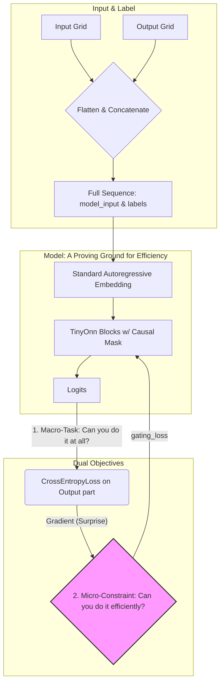

# 技术日志：`Tiny-ONN-ARC` 的演进之路 (v5.0)

## 1. 核心问题：ARC 的本质是什么？

在经历了多次失败的迭代后，我们最终回归到一个根本性问题：ARC (Abstraction and Reasoning Corpus) 任务的本质，究竟是对像素的重建，还是对算法的归纳？

我们的结论是：**两者都是，但后者是前者的因。** ARC 要求模型推导出输入-输出对背后隐藏的抽象“规则”，然后将该规则应用于新的输入，以生成正确的输出。

这是一个**推理 (Reasoning)** 任务，而不是一个简单的**模式匹配 (Pattern Matching)** 任务。

## 2. 演进的终点：受计算效率约束的自回归推理

我们最终确立的 v5.0 范式，是对这个核心问题最直接、最深刻的回答。它放弃了所有试图走捷径的复杂设计（如并行生成、二维嵌入），回归到最纯粹、最强大的序列建模范式，但为其注入了 `Tiny-ONN` 的核心灵魂：**一个旨在最大化信息整合效率 (Ω) 的内在驱动力。**

### v5.0 方案：用“惊奇最小化”驱动“智能最大化”

**核心思想**：我们不直接教模型“如何”解决问题。我们只给它设定两个目标，并相信智能会作为实现这两个目标的**最优解**而**涌现**出来。

1. **宏观任务目标 (`main_loss`)**: 学会一个看似微不足道的“作弊”任务——**在给定完整上下文 `[Input, Output]` 的情况下，准确地预测出 `Output` 部分的每一个像素。**

   - **实现方式**: 我们将输入网格和输出网格展平并拼接成一个长序列 `[Input, Output]` 作为模型的输入。模型的标签 `labels` 也是这个序列。通过标准的自回归因果掩码和交叉熵损失，模型被训练来完成这个“恒等映射”。
   - **表面目的**: 确保模型具备基本的序列转换能力。
   - **深层目的**: 创造一个巨大的、包含无数种可能解法的“任务空间”。

2. **微观效率约束 (`gating_loss` / `SurpriseMin`)**: 在模型探索如何完成上述“作弊”任务时，我们施加一个无处不在的、强大的内在约束——**以最低的计算成本（即最小的“惊奇度”）来完成它。**
   - **“惊奇度”的定义**: 对任何一个专家（无论是注意力头还是 MLP），其“惊奇度”被定义为 `main_loss` 对该专家输出的梯度范数。一个高惊奇度的专家，意味着它的计算对最终结果造成了巨大的、计划外的扰动。
   - **工作原理**: `SurpriseMin` 损失函数直接惩罚那些选择了高惊奇度专家的门控网络。这迫使门控网络成为一个高效的“调度员”，学会将信息路由到能以最“平静”、最“优雅”的方式处理它的专家那里。

### 智能的涌现：从“作弊”到“理解”

这个双重目标的设计，是整个方案的点睛之笔。

- 模型为了降低 `main_loss`，必须学会**如何**将输入变换为输出。
- 模型为了降低 `gating_loss`，必须学会在所有可能的变换方法中，找到**计算上最简洁、最抽象**的那一种。

当模型面对 `[A -> B]` 的例子时，它可能会发现无数种复杂的像素操作可以完成这个映射。但这些操作通常是“高惊奇度”的。相比之下，一个简单的、抽象的规则（例如，“将所有蓝色方块向上平移一格”）所对应的计算路径，其“惊奇度”要低得多。

因此，**`SurpriseMin` 压力会迫使模型放弃对像素的死记硬背，转而寻找并编码那个底层的、抽象的“算法”**。这就是从“作弊”到“理解”的飞跃。

**我们最终要观测的指标，不是 `Acc(Tok)`，而是 `GateAcc` 的提升、`L(G)` 的下降和 `K(S/M)` (平均激活专家数) 的降低，以及最终的 `Val Acc(Grid)`。这些才是智能在计算成本压力下，进行自我组织的直接证据。**

### v5.0 架构图

