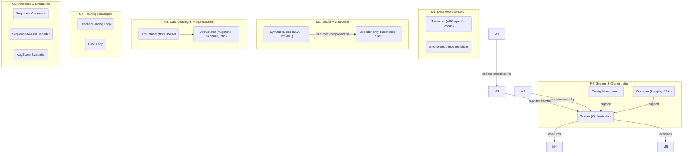

# Tiny-ONN-ARC: 项目报告与实施计划 (v1.1)

## 摘要

`Tiny-ONN-ARC` 是一个为解决 `ARC-AGI-2` 抽象推理任务而设计的专用语言模型。作为 `Tiny-ONN` 项目的一个分支，它继承了**超稀疏混合专家 (Hyper-SMoE)** 的核心思想，并针对 ARC 任务的特性进行了深度特化。模型架构基于 **NSA (原生稀疏注意力)** 和 **SDL DynMoE (动态专家混合)**，并采用 **TF+EAVI 双阶段训练框架**，旨在通过模拟“快速学习”与“深度思考”两个阶段，最终实现对抽象规则的归纳与应用。

---

## 1. 系统架构

整个系统被解构成六个核心功能模块，它们协同工作，构成一个完整的数据处理、训练、推理和评估流水线。

### 1.1. 架构总览

### 1.2. 模块详解

- **M1: 数据表征**:

  - **Tokenizer**: 使用一个极小的、针对 ARC 任务的专属词汇表，包含 0-9 的颜色 token 和必要的控制 token (`<|im_start|>`, `<|im_end|>`, `problem`, `solution` 等)。
  - **Serializer**: 将 2D 网格及其坐标信息线性化为 1D token 序列。这是模型能够理解空间关系的基础。

- **M2: 模型架构**:

  - **核心**: `ArcTransformer`，一个标准的 Decoder-only Transformer 骨架。
  - **创新**: 其核心计算单元是 `DynONNBlock`，它用 **NSA (原生稀疏注意力)** 和 **SDL DynMoE (动态专家混合)** 分别取代了标准的自注意力和前馈网络层。

- **M3: 数据加载与预处理**:

  - **职责**: 构建一个健壮、高效的数据管道。
  - **流程**: 1. `ArcDataset` 从 JSON 文件中读取原始的、尺寸不一的网格对。 2. `DataLoader` 从 `Dataset` 中采样一批数据。 3. **`ArcCollator`** (可调用类) 作为 `collate_fn`，是整个流程的核心。它负责：
    - 对批次中的每个网格应用 **D8 对称变换** 进行数据增强。
    - 调用 `Serializer` 将增强后的网格转换为 token 序列。
    - 使用 `pad_sequence` 将长度不一的序列填充为规整的批处理张量。
  - **保证**: `DataLoader` 直接产出可供模型计算的、规整的批处理张量。

- **M4: 训练范式**:

  - 详见第 2 节。

- **M5: 推理与评估**:

  - `Sequence Generator`: 自回归生成器，用于在推理时生成解答序列。
  - `Grid Decoder`: `Serializer` 的逆过程，将 token 序列解码回 2D 网格。
  - `AugScore Evaluator`: 详见第 2 节。

- **M6: 系统与编排**:
  - `Trainer`: 作为顶层协调器，负责驱动训练、评估、检查点保存/加载等所有流程。
  - `Config` & `Observer`: 提供配置管理和日志观测能力。

---

## 2. 核心范式

### 2.1. TF+EAVI 双阶段训练框架

为解决 ARC 任务对局部模式匹配和全局抽象推理的双重需求，我们设计了一个双阶段训练框架。

- **阶段一: Teacher Forcing (TF) 预训练**

  - **目标**: 快速学习 ARC 任务的“语法”和局部模式规则。
  - **方法**: 使用标准的自回归训练。模型被给予一个完整的“问题-答案”序列，并被要求在每个时间步预测下一个正确的 token。训练将在多个数据增强视图上进行，以学习几何不变性。
  - **作用**: 此阶段计算效率高，能让模型快速掌握基础知识，并促使 MoE 专家进行初步的功能分化。

- **阶段二: EAVI (Excursion-Alignment Variational Inference) 对齐**
  - **目标**: 克服 TF 阶段带来的“暴露偏差” (Exposure Bias)，迫使模型学习真正的全局推理能力。
  - **方法**: 1. **Excursion (执行)**: 在 `torch.no_grad()` 上下文中，让模型从问题开始，**独立地、自回归地**生成一个完整的解答序列。 2. **Alignment (对齐)**: 将“真实输入 + **生成**输出”与“真实输入 + **真实**输出”构成一个“超级批次”，同时送入模型进行一次前向传播，并计算一个全局的对齐损失 (CrossEntropy)。
  - **作用**: 这个全局损失信号直接惩罚模型在独立生成时犯的任何一个错误，迫使其从依赖局部上下文的“模仿者”转变为能够进行长程规划的“思考者”。

### 2.2. AugScore 多视角一致性评估

- **动机**: 一个真正理解了抽象规则的模型，其对一个问题的解答不应因观察视角（如旋转或翻转）的改变而改变。
- **方法**:
  1. **并行生成**: 将一个测试问题进行所有 8 种 D8 对称变换，形成 8 个不同的“视角”。让模型为每个视角生成一个或多个候选解答。
  2. **逆变换与聚合**: 将所有生成的解答通过逆变换统一到原始坐标系下，形成一个候选池。
  3. **交叉评分**: 对候选池中的**每一个**候选解，我们再将其变换到所有 8 个视角，并计算模型在每个视角下生成该解的**对数概率**。
  4. **最终选择**: 将一个候选解在 8 个视角下的对数概率求和，得到其最终的 `AugScore`。分数最高的候选解被认为是模型“共识度”最高、最鲁棒的答案。

---

## 3. 实施计划

我们将清理 `exp/tiny_onn_arc` 目录，并遵循以下阶段从头开始构建。

- **阶段一: 基础建设 (Foundation)**

  - [ ] **M3. 数据管道**: 实现 `ArcDataset` 和健壮的 `ArcCollator` 类。确保 `DataLoader` 能够稳定地产出经过增强和填充的规整批次。
  - [ ] **M1. 数据表征**: 实现 `ArcChatMLTokenizer` 和 `ArcCollator` 中所需的 `Serializer` 逻辑。
  - [ ] **M2. 模型架构**: 实现 `DynONNBlock` 和 `ArcTransformer` 的骨架。
  - **验收标准**: 能够成功加载数据，并通过模型进行一次前向传播而无报错。

- **阶段二: 训练与评估框架 (Training & Evaluation Framework)**

  - [ ] **M6. 系统**: 实现 `Trainer` 类的基本骨架，包括优化器、检查点管理。
  - [ ] **M4. 训练范式**: 实现 `Teacher Forcing` 训练循环逻辑。
  - [ ] **M5. 推理**: 实现 `generate_sequence` 和 `decode_grid` 函数。
  - [ ] **M5. 评估**: 实现一个简化的、单视角的评估循环。
  - **验收标准**: 能够以 `Teacher Forcing` 模式完整地运行一次训练和评估。

- **阶段三: 高级范式实现 (Advanced Paradigms)**
  - [ ] **M4. 训练范式**: 实现 `EAVI` 训练循环逻辑。
  - [ ] **M5. 评估**: 完整实现 `AugScore Evaluator` 及其交叉评分逻辑。
  - **验收标准**: 能够以 `EAVI` 模式运行，并使用 `AugScore` 进行评估，完成最终的冒烟测试。
