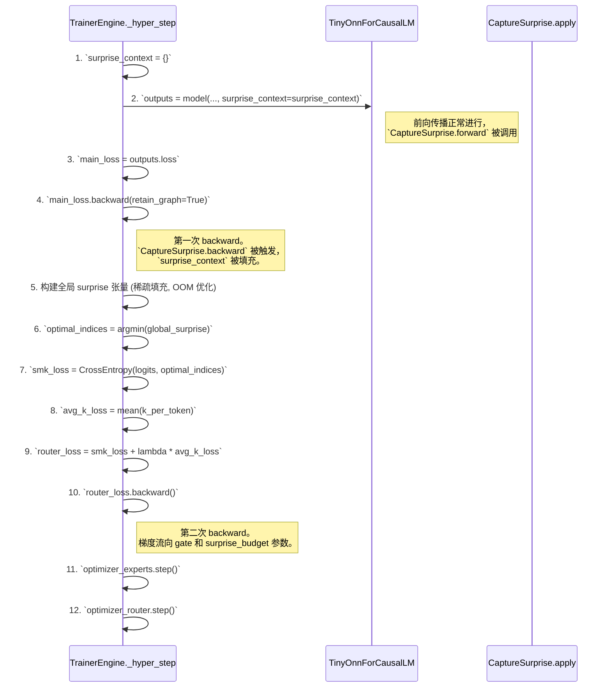

# Tiny-ONN 最终架构与训练范式 (V31)

## 1. 核心思想：解耦元学习

通过**解耦元学习 (Decoupled Meta-Learning)** 范式，训练一个动态稀疏混合专家（SMoE）语言模型。其核心机制是：

- **专家网络（快系统）**: 专注于最小化传统预测误差 (`L_main`)。
- **门控网络（慢系统）**: 通过元学习，学会预测并将每个 Token 路由到能以**最低学习成本**（即最小的梯度范数，作为“Surprise”的代理）处理它的专家。

这种设计旨在通过动态稀疏路由在架构层面“物理隔离”专家的知识领域以对抗灾难性遗忘，并通过元学习优化路由策略以提高模型的能效比与性能。

## 2. 核心架构：基于 Qwen3 的动态稀疏 MoE

我们将 `Qwen3` 的稠密 `MLP` 层替换为自定义的 `TinyOnnMoE` 模块，其关键特性如下：

- **海量轻量专家**: 将模型的复杂性从“单个专家的深度”转移到了“海量专家间的协同”。

  - `num_experts_per_layer`: 32
  - `moe_intermediate_size`: 64 (每个专家网络极度轻量)

- **动态 K 选择与自适应预算**: 门控网络为每个 Token 动态决定激活 (`K`) 多少专家。`K` 的值由一个**可学习的参数 `surprise_budget` (`pi_alpha`)** 动态决定。
  1. `router_logits` 预测每个 expert 的亲和度（与预期 surprise 负相关）。
  2. `softmax(-router_logits)` 将其转换为概率分布。
  3. 选择激活概率最高的若干 experts，直到累积概率达到可学习的 `surprise_budget` 上限。

## 3. 训练范式：基于 `autograd.Function` 的三位一体损失

**此为官方唯一指定的训练范式**，它取代了所有基于 `hook` 的旧方案。其核心是使用自定义的 `autograd.Function` 来精确捕获梯度，并通过一个三位一体的复合损失函数来实现解耦元学习。

### 核心流程

### 实现细节

1. **`CaptureSurprise` (`training/autograd.py`)**:
    - 一个自定义的 `torch.autograd.Function`，充当“梯度探测器”。
    - **`forward`**: 充当恒等函数，但在 `ctx` 中保存关键上下文（`layer_idx`, `expert_idx`, `token_indices` 等）。
    - **`backward`**: 接收到的 `grad_output` 即 `d(loss)/d(expert_input)`。它将计算出的 `surprise` 和上下文一起存入一个外部字典 `surprise_context`，然后将梯度原封不动地传回主计算图。

2. **`TinyOnnMoE` (`tiny_onn/modular.py`)**:
    - `surprise_budget` (`pi_alpha`) 被定义为一个可学习的 `nn.Parameter`，并参与 `optimizer_router` 的优化。
    - 在 `forward` 过程中，将 `expert` 的输入用 `CaptureSurprise.apply(...)` 包装起来，并将 `surprise_context` 字典和层、专家索引传递进去。

3. **`TrainerEngine` (`training/engine.py`)**:
   - **职责**: 实现上述 Mermaid 图所示的双层优化循环。
   - 在 `main_loss.backward()` 之后，使用 `surprise_context` 字典中的稀疏数据，“即时”编译出一个与 `concatenated_logits` 形状相同的稠密 `per_token_surprise` 张量，未激活的 expert 填充 `inf`。
   - 使用 `attention_mask` 过滤 `router_logits` 和 `per_token_surprise`，确保只在有效 (非-padding) token 上计算 `router_loss`。

## 4. 观测与验证

训练过程必须记录并可视化在 [`observability_plan.md`](./.roo/rules/observability_plan.md) 中定义的核心指标，特别是：

- **`gating_acc`**: 门控的路由选择与事后计算出的最小 Surprise 专家的匹配度。这是衡量元学习是否成功的关键指标。
- **`pi_score`**: 模型的整体预测完整性分数。
- **专家激活热力图**: 观察专家是否在不同任务上形成功能分化。
