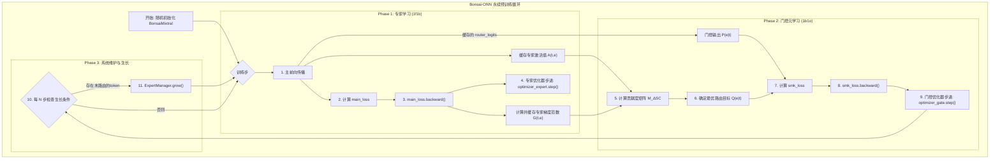

# Tiny-ONN 最终架构 V2：Bonsai-ONN 的有机生长范式

## 1. 核心思想：基于 FEP 的自适应、自组织智能体

我们放弃“器官嫁接”式的模型手术，回归第一性原理。我们将从一个极简的、随机初始化的“盆景模型”（Bonsai-ONN）开始，通过一种模拟有机体发育的“永续预训练”范式，让其成为一个**在有限资源下通过高效信息整合（专家分化与动态生长）来最小化自身变分自由能（VFE）的自组织智能体。**

- **内部状态 (Internal States) - 专家网络**: 一组**超迷你**专家，负责对世界（数据）建立生成模型。其学习目标是最小化**预测误差 (`main_loss`)**。
- **马尔可夫毯 (Markov Blanket) - 门控网络**: 负责感知内部状态（专家处理信息的“性价比”`ΔSC`）并采取行动（路由决策）。其学习目标是**将信息路由到能以最高协同贡献（最大化 `ΔSC`）处理它的专家**，从而以最高效率降低整个系统的 VFE。
- **生长机制**: 模型的**横向宽度（专家数量）**是动态的。当系统无法有效处理某些新信息时（体现为存在未被路由的 token），它会“生长”出新的专家来专门应对这些信息，这是一种结构性的主动推理。

## 2. 核心架构：基于 Mixtral 的 Bonsai-ONN

我们以 `Mixtral` 的纯粹稀疏 MoE 架构为基座，因为它没有共享专家等理论上模糊的设计，与我们的 FEP 框架完美契合。

- **模型**: 从一个极小的、随机初始化的 `BonsaiMixtral` 模型开始（例如，4 层，64 隐层维度）。
- **专家**: 采用“超迷你”专家（例如，`moe_intermediate_size = 128`），迫使系统通过高效的协作和分化来学习。
- **动态性**: 模型的深度（层数）固定，但每层的专家数量可以从一个小的初始值（如 4）动态增长到一个上限（如 64）。

## 3. 训练范式：1f2b2o + ΔSC 驱动的元学习 + 动态生长

### 3.1. 核心元学习目标：基于 ΔSC 的 smk_loss

这是我们整个理论框架的基石。我们放弃所有启发式的代理，将门控的学习目标严格锚定在**最大化协同贡献（ΔSC）**上。

**`smk_loss = CrossEntropy(P(e|t), Q(e|t))`**

其中，理想的路由分布 `Q(e|t)` 是一个在 `argmax_e M_ΔSC[t, e]` 的专家 `e` 上为 1 的 one-hot 向量，而贡献度矩阵 `M_ΔSC` 定义为：

**`M_ΔSC[t, e] = log(1 + ||Activation||) - log(1 + ||Gradient||)`**

### 3.2. 核心流程图

### 3.3. 关键机制详解

- **PI 自适应衰减**: 我们将**暂时禁用**此机制，或将其权重 (`lambda_balance`) 设置为一个极小的常数。在我们的新范式下，`smk_loss` 应该成为绝对主导的学习信号。负载均衡应作为系统自组织的结果，而不是一个强制的目标。
- **动态生长 (`ExpertManager.grow()`)**: 当存在未被任何专家路由的 token 时触发。新专家的门控参数将由这些“被遗弃”的 token 的平均隐藏状态来初始化，而其自身权重则通过对现有专家进行加权平均来初始化。
