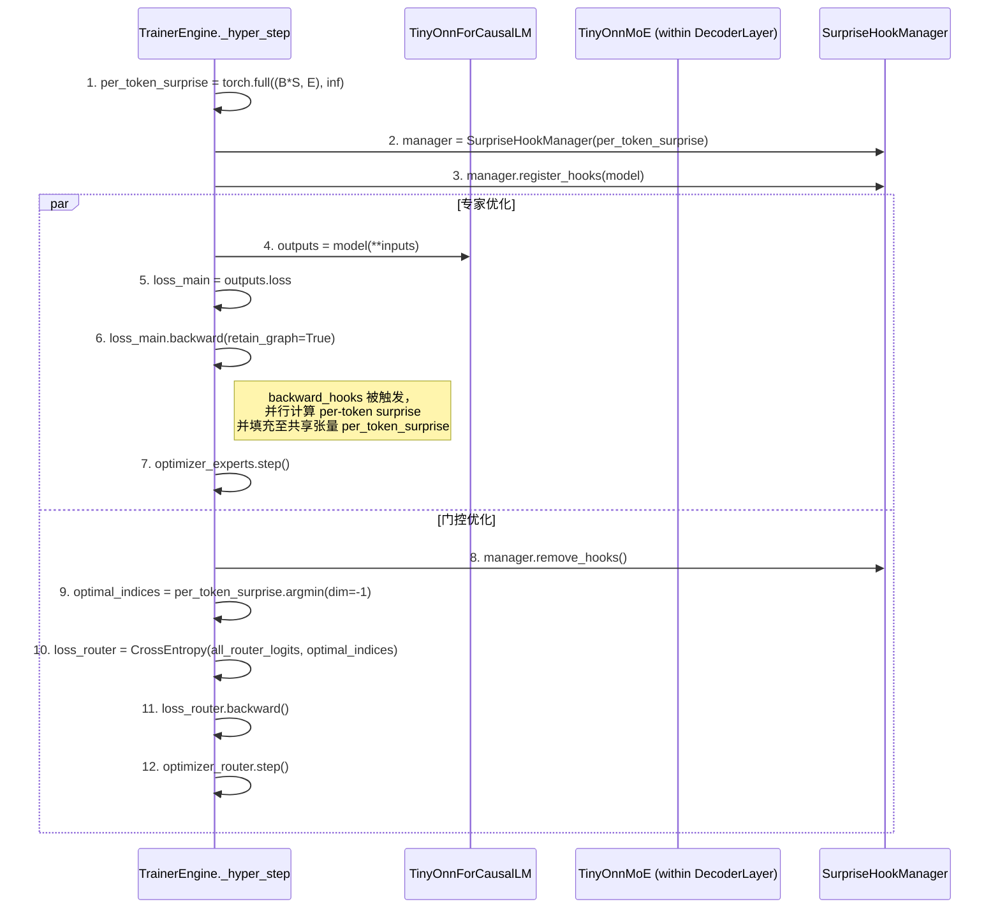

# Tiny-ONN 最终架构与训练范式 (V2)

## 1. 核心思想：解耦元学习

通过**解耦元学习 (Decoupled Meta-Learning)** 范式，训练一个动态稀疏混合专家（SMoE）语言模型。其核心机制是：

- **专家网络（快系统）**: 专注于最小化传统预测误差 (`L_main`)。
- **门控网络（慢系统）**: 通过元学习，学会预测并将每个 Token 路由到能以**最低学习成本**（即最小的梯度范数，作为“Surprise”的代理）处理它的专家。

这种设计旨在通过动态稀疏路由在架构层面“物理隔离”专家的知识领域以对抗灾难性遗忘，并通过元学习优化路由策略以提高模型的能效比与性能。

## 2. 核心架构：基于 Qwen3 的动态稀疏 MoE

我们将 `Qwen3` 的稠密 `MLP` 层替换为自定义的 `TinyOnnMoE` 模块，其关键特性如下：

- **海量轻量专家**: 将模型的复杂性从“单个专家的深度”转移到了“海量专家间的协同”。

  - `num_experts_per_layer`: 32
  - `moe_intermediate_size`: 64 (每个专家网络极度轻量)

- **动态 K 选择 (Surprise Budgeting)**: 门控网络为每个 Token 动态决定激活多少个 (`K`) 专家。此决策借鉴了 `DynMoE` 的显式可变 Top-K 思想，并与我们的理论结合：
  1. 门控网络为每个 Token 输出对所有专家的亲和度 `router_logits`。
  2. 根据 `router_logits` 计算“预期 Surprise”的概率分布。
  3. 选择激活预期 Surprise 最低的若干专家，直到它们的累积概率达到全局超参数**认知预算** (`surprise_budget`) 的上限。
  4. 这套机制已在 [`tiny_onn/modular.py`](./tiny_onn/modular.py) 的 `TinyOnnMoE.forward` 方法中初步实现。

## 3. 训练范式：基于 Hooks 的双层优化 (V6 方案)

**此为官方唯一指定的训练范式**，它取代了所有基于 `torch.autograd.grad` 的旧方案。其核心是基于 `PyTorch Hooks` 和**稀疏填充 (Sparse Fill)**机制，在一个训练步内实现对专家和门控的解耦优化。

### 核心流程

### 实现细节

1. **`SurpriseHookManager` (`training/hooks.py`)**:

   - **职责**: 封装所有 `hook` 注册、移除以及计算逻辑。
   - `__init__`: 接收一个在 `TrainerEngine` 中创建的、形状为 `(batch_size * seq_len, num_experts)` 的共享张量 `per_token_surprise`，并用 `inf` 初始化。
   - `register_hooks`: 遍历模型所有 `TinyOnnMoE` 层，为每个 `expert` 的 `w2` 权重注册 `forward` 和 `full_backward_hook`。
   - **`forward_hook`**: 捕获并暂存每个 expert 处理的 `input` 张量及其在 `(batch*seq_len)` 维度下的**原始 token 索引**。
   - **`full_backward_hook`**: 利用暂存的输入、索引和 `grad_output`，计算出 `surprise` 向量，并使用原始 token 索引**直接、正确地**将其填充到共享的 `per_token_surprise` 张量的相应 `[token_indices, expert_idx]` 位置。

2. **`TinyOnnMoE` (`tiny_onn/modular.py`)**:

   - **职责**: 在 `forward` 过程中，必须暂存每个 expert 处理的 `input` 张量，以及对应的**原始 token 索引** `last_expert_token_indices`，供 `forward_hook` 捕获。

3. **`TrainerEngine` (`training/engine.py`)**:
   - **职责**: 实现上述 Mermaid 图所示的双层优化循环。
   - 在 `loss_main.backward()` **之前**，初始化 `per_token_surprise` 张量和 `SurpriseHookManager`，并注册 hooks。
   - 在 `loss_main.backward()` **之后**，移除 hooks。
   - 使用 `attention_mask` 过滤 `router_logits` 和 `per_token_surprise`，确保只在有效 (非-padding) token 上计算 `router_loss`。

## 4. 观测与验证

训练过程必须记录并可视化在 [`observability_plan.md`](./.roo/rules/observability_plan.md) 中定义的核心指标，特别是：

- **`gating_acc`**: 门控的路由选择与事后计算出的最小 Surprise 专家的匹配度。这是衡量元学习是否成功的关键指标。
- **`pi_score`**: 模型的整体预测完整性分数。
- **专家激活热力图**: 观察专家是否在不同任务上形成功能分化。
