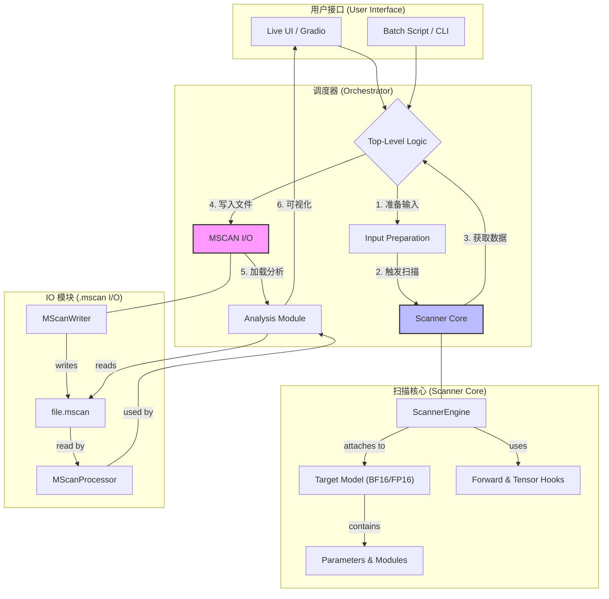

# ΔSC 扫描器架构设计

**版本:** 1.0
**日期:** 2025-07-15

## 1. 核心设计哲学

本架构旨在构建一个模块化、可扩展且高性能的“数字 fMRI”扫描系统。其核心设计遵循“关注点分离”原则，将数据采集、存储和分析解耦，确保系统在不同应用场景（交互式探索 vs. 批量处理）下的健壮性与可维护性。

## 2. 核心模块概览

系统由三大核心模块组成：**调度器 (Orchestrator)**、**IO 模块 (`.mscan` I/O)** 和 **扫描核心 (Scanner Core)**。

## 3. 模块详解

### 3.1 调度器 (Orchestrator)

- **角色**: 系统的高层逻辑控制器，负责协调其他模块完成一次完整的扫描任务。
- **实现**:
  - **交互式**: `scanner/app.py`，通过 Gradio UI 接收用户输入，驱动单次扫描-分析-可视化流程。
  - **批量式**: `scripts/batch_scanner.py`，通过命令行接收参数，驱动对整个数据集的自动化扫描。
- **核心职责**:
  1. **输入准备**: 加载模型和分词器，根据用户输入或数据集样本，格式化 `input_ids` 和 `labels`。
  2. **触发扫描**: 实例化并调用 `Scanner Core`，执行前向和反向传播。
  3. **数据持久化**: 从 `Scanner Core` 获取采集到的数据，并调用 `IO 模块` 将其写入 `.mscan` 文件。
  4. **触发分析**: （主要在交互模式下）调用 `Analysis` 模块加载扫描结果并生成可视化。

### 3.2 IO 模块 (`.mscan` I/O)

- **角色**: 负责 `.mscan` 文件的读写，是数据持久化的唯一接口。
- **核心组件**:
  - **`MScanWriter` (`scanner/io.py`)**:
    - **功能**: 创建并写入 `.mscan` 文件。管理文件头、JSON 元数据和二进制记录的追加。
    - **关键特性**:
      - **原子性**: 使用 `with` 语句确保文件在写入完成后（即使发生错误）也能被正确关闭并更新最终的头信息（如总记录数）。
      - **流式写入**: 支持分批次、流式地向文件追加记录，适用于大规模批量扫描。
  - **`load_mscan_file` (`scanner/io.py`)**:
    - **功能**: 读取 `.mscan` 文件。
    - **关键特性**:
      - **内存映射 (`np.memmap`)**: 对二进制数据部分使用内存映射，实现了在不消耗大量物理内存的情况下，对超大规模扫描文件的高性能随机访问。
- **数据格式 (`.mscan`)**:
  - 一个自包含的二进制文件，结构为 `[HEADER][JSON METADATA][RAW BINARY RECORDS]`。
  - **元数据 (JSON)**: 包含模型名称、参数ID到名称的映射 (`id_to_param_name_map`)、扫描序列信息等。
  - **记录 (NumPy `dtype`)**: 包含 `token_idx`, `param_id`, `block_idx`, `activation`, `grad_norm` 等核心指标，被量化为 `uint16`/`uint32` 以节约空间。

### 3.3 扫描核心 (Scanner Core)

- **角色**: 系统的“探针”，直接与 PyTorch 模型交互，负责在运行时捕获激活值和梯度。
- **核心组件**:
  - **`ScannerEngine` (`scanner/engine/v2_engine.py`)**:
    - **核心策略**: 采用**前向与张量双钩子（Forward & Tensor Dual-Hook）协同策略**。这是在多次失败尝试后确定的最终技术路线。
      1. **激活值捕获**: 使用 `module.register_forward_hook` 在模块级（如 `nn.Linear`）捕获其**输出激活值**。
      2. **梯度捕获**: 使用 `tensor.register_hook` 在参数级（如 `module.weight`）捕获其**最终累积梯度 (`.grad`)**。
    - **战略放弃**:
      - **`autograd.Function`**: 因其侵入性过强，破坏 `transformers` 内部优化，已被废弃。
      - **`register_full_backward_hook`**: 因其捕获的是模块间的 `grad_input`/`grad_output`，而非我们需要的参数权重梯度 `weight.grad`，已被废弃。
- **关键约束**:
  - **全精度模式**: 根据 `phase_1_gradient_capture_debrief.md` 的最终结论，`Scanner Core` **必须**在 **BF16** 或 **FP16** 全精度模式下运行。`bitsandbytes` 的 4-bit 量化模式因其权重张量 `requires_grad=False`，无法用于梯度捕获。
