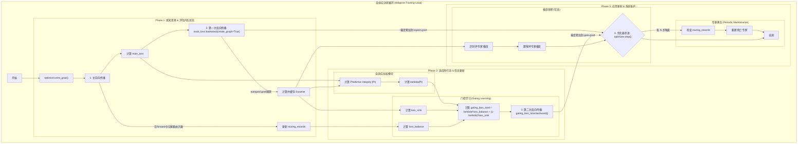

# Tiny-ONN 最终架构：自适应训练范式

## 1. 核心思想：基于 FEP 的自适应解耦元学习

我们训练一个动态稀疏混合专家（SMoE）语言模型，其核心是模拟一个**具有发展阶段的、自我调节的智能体**。该智能体遵循自由能原理（FEP），通过一个**自适应的、解耦的元学习范式**来最小化其变分自由能。

- **内部状态 (Internal States) - 专家网络**: 负责建立世界（数据）的生成模型。其学习目标是最小化**预测误差 (`main_loss`)**。
- **马尔可夫毯 (Markov Blanket) - 门控网络**: 负责感知内部状态（`Surprise`）并采取行动（路由决策）。其学习目标是**在探索与利用之间取得动态平衡**，最终将任务路由到能以**最低学习成本 (`Surprise`)** 高效处理它的专家。

## 2. 核心架构：基于 DynMoE 的动态稀疏 MoE

我们将 `Qwen3` 的稠密 `MLP` 层替换为自定义的 `TinyOnnMoE` 模块，其关键特性是基于**动态 K 选择 (DynMoE)** 的激活机制。

## 3. 训练范式：1f2b1o + PI 自适应衰减 + 专家再生

我们采用**单一优化器**，通过**两次反向传播**和**一个自适应的门控损失函数**来高效地实现解耦的元学习目标。

### 3.1. 核心流程图

### 3.2. 关键机制详解

#### a. PI 自适应衰减 (探索-利用的权衡)

门控的总损失由两部分加权构成，其权重 `lambda` 由模型的**预测完整性 (PI)** 动态决定：

**`gating_loss_total = lambda(PI) * loss_balance + (1 - lambda(PI)) * loss_smk`**

- **`loss_balance` (探索)**: 借鉴 DynMoE 的负载均衡损失。它惩罚路由的集中度，强制门控在训练早期探索所有专家，为系统提供丰富的学习信号。
- **`loss_smk` (利用)**: 我们的核心元学习损失。它驱动门控将任务精确路由到 `Surprise` 最小的专家，以提纯知识、提升效率。
- **`lambda(PI)`**: 一个将 `PI` 分数映射到 [0, 1] 区间的函数。当 `PI` 低时（模型不稳定），`lambda` 接近 1，系统偏向**探索**。当 `PI` 高时（模型稳定），`lambda` 接近 0，系统偏向**利用**。这使得模型可以根据自身的“认知状态”自主决定发展阶段。

#### b. 专家再生机制 (防止“神经元死亡”)

- **识别**: 借鉴 DynMoE，我们通过**路由计数 (`routing_records`)** 来识别“死亡”专家。在每个维护周期（N 步）内，路由计数为 0 的专家被视为死亡。
- **再生**: 在每个维护周期结束时，对所有“死亡”专家的参数进行重新初始化，并将路由计数器清零。这为模型提供了持续学习和摆脱局部最优的能力。

## 4. 观测与验证

- **`gating_acc`**: 衡量**利用**任务（SMK）的学习效果。
- **`loss_balance`**: 衡量**探索**任务的执行情况。
- **`lambda`**: 观测模型“探索-利用”策略的动态变化。
- **`PI`**: 监控模型的整体“认知健康度”。
- **活跃专家数/热力图**: 验证专家再生机制的有效性。
