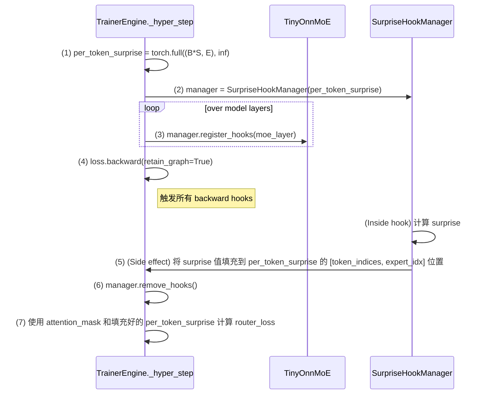

# Tiny-ONN 重构实施方案 (V6 - Hooks & Sparse Fill)

## 0. 背景与目的

本文档是对 `final_refactoring_plan.md` 的最终修正。经过多次失败的尝试和深刻反思（执行规则零），我们确定了先前基于 `torch.autograd.grad` 和复杂 `einsum` 的方案存在根本性的理论缺陷。本方案将回归到项目最初在 `exp/grad_hook_poc` 中验证过的、基于 `hooks` 的技术路径，并引入一个简洁高效的**稀疏填充 (Sparse Fill)**机制来解决核心的维度对齐问题。**此文件是后续所有代码修改的唯一依据。**

## 1. 核心问题诊断

先前所有方案失败的根本原因在于，未能正确处理 MoE 路由的不平衡性所导致的 surprise 张量与 router_logits 张量之间的维度不匹配问题。`backward_hook`为每个 expert 计算的 surprise 向量长度不同，且丢失了与原始 token 序列的对应关系，使其无法与 `(batch * seq_len, num_experts)` 形状的 `router_logits` 对齐。

## 2. 修正后的重构路线图 (V6)

我们将采用一个基于 `hooks` 和索引映射的稀疏填充方案，来确保理论的正确性和实现的健壮性。

### 步骤一 & 二 & 三 (已完成)

- **状态**: 已完成。
- **内容**:
  1. 统一配置项，全局使用 `pi_alpha` 作为 `surprise_budget`。
  2. 重构 `TinyOnnMoE.forward` 以实现更优的动态 K 选择和向量化的 token 分发。
  3. 重构 `TinyOnnDecoderLayer.forward` 以优雅地通过 `**kwargs` 传递参数。

### 步骤四 (新方案): 基于 Hooks 和稀疏填充重构训练引擎

- **任务**: 彻底重构 `training/engine.py` 的 `_hyper_step` 方法和相关模块，以实现正确的逐 Token Surprise 计算。
- **核心机制**: 在 `TrainerEngine` 中创建一个全局的 `per_token_surprise` 张量，`hooks` 负责向其中填充计算出的 surprise 值。

- **实现**:

  1. **创建 `training/hooks.py`** (`code` 模式)

     - **任务**: 定义 `SurpriseHookManager` 类，封装 `forward` 和 `backward` hook 的全部逻辑。
     - **细节**:
       - `__init__`: 接收一个外部创建的、用于填充的 `per_token_surprise` 张量。
       - `register_hooks`: 遍历 MoE 层中的所有 expert，为每个 expert 的 `w2` 权重注册 `forward_hook` 和 `full_backward_hook`。
       - `save_inputs_hook` (`forward`): 捕获并暂存 `w2` 层的输入张量，以及该输入张量对应的、在 `(batch * seq_len)` 维度中的**原始 token 索引**。
       - `compute_surprise_hook` (`backward`): 利用暂存的输入、索引和传入的 `grad_output`，计算出 `surprise` 向量，并使用 `original_token_indices` 将其**直接、正确地**填充到共享的 `per_token_surprise` 张量中。
       - `remove_hooks`: 移除所有已注册的 hook，防止内存泄漏。

  2. **修改 `tiny_onn/modular.py`** (`code` 模式)

     - **任务**: 在 `TinyOnnMoE.forward` 中，除了暂存 `last_expert_inputs` 外，还必须暂存 `last_expert_token_indices`，即每个 expert 所处理的 tokens 在 `(batch * seq_len)` 维度下的**原始索引**。这是实现索引映射的关键。

  3. **重构 `training/engine.py`** (`code` 模式)

     - **任务**: 彻底重写 `_hyper_step` 的第二阶段。
     - **细节**:
       - 在 `loss.backward()` 之前，初始化 `per_token_surprise` 张量和 `SurpriseHookManager`。
       - 调用 `manager.register_hooks(model)`。
       - 执行 `loss.backward(retain_graph=True)`。
       - 调用 `manager.remove_hooks()`。
       - 使用 `attention_mask` 过滤 `router_logits` 和 `per_token_surprise`，确保只在有效 token 上计算 `router_loss`。

  4. **适配并运行测试** (`debug` 模式)
     - **任务**: 更新 `tests/test_autograd_surprise.py`（可重命名为 `tests/test_surprise_calculation.py`）以验证新的 hook 机制。运行所有相关测试。

## 3. 实施保障

- **小步提交**: 每完成上述一个核心步骤，都应视为一个独立的、可验证的单元。
- **善用测试**: 最终必须通过所有相关测试，包括 `test_e2e_meta_learning.py`, `test_dynmoe.py`, 和新的 `test_surprise_calculation.py`。
