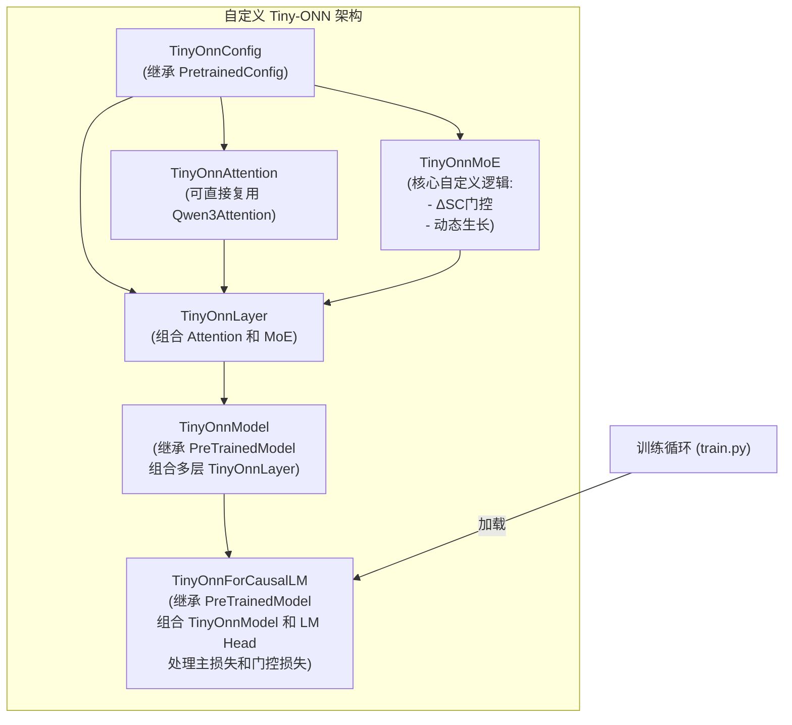
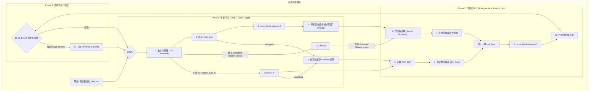

# Tiny-ONN 架构与实现笔记

## 1. 核心思想：基于 FEP 的自适应、自组织智能体

我们放弃“器官嫁接”式的模型手术，回归第一性原理。我们将从一个极简的、随机初始化的“盆景模型”开始，通过一种模拟有机体发育的“永续预训练”范式，让其成为一个**在有限资源下通过高效信息整合（专家分化与动态生长）来最小化自身变分自由能（VFE）的自组织智能体。**

- **内部状态 (Internal States) - 专家网络**: 一组**超迷你**专家，负责对世界（数据）建立生成模型。其学习目标是最小化**预测误差 (`main_loss`)**，并在一个受保护的梯度环境（选择性激活和基于正态分布阈值的梯度过滤）中稳定学习。
- **马尔可夫毯 (Markov Blanket) - 门控网络**: 负责感知内部状态（`ΔSC`）并采取行动（路由决策）。其学习目标是**将信息路由到能以最高协同贡献（最大化 `ΔSC`）处理它的专家**，从而以最高效率降低整个系统的 VFE。
- **生长机制**: 模型的**横向宽度（专家数量）**是动态的。当系统无法有效处理某些新信息时（体现为存在未被路由的 token），它会“生长”出新的专家来专门应对这些信息，这是一种结构性的主动推理。

## 2. 核心架构：基于模块化组合的 Tiny-ONN

根据 `transformers` 库的最佳实践，我们放弃对 `Mixtral` 等现有模型的深度修改。我们将采用**组合优于继承**的原则，从 `PreTrainedModel` 等基础组件开始，像搭积木一样构建我们自己的、完全独立的 `TinyOnn` 模型。

这种方法的核心优势在于**代码清晰、可维护性高、与上游库解耦**，避免了未来因 `transformers` 库更新而导致的兼容性问题。

## 3. 训练范式：2f2b2o - 解耦的专家学习与门控元学习

### 3.1. 核心流程图

### 3.2. 核心元学习机制：基于 ΔSC 的 `gating_loss`

#### a. 梯度捕获 (`autograd.grad` - 已验证方案)

经 PoC 脚本 (`exp/final_grad_poc.py`) 最终实验验证，捕获 `per-token-per-expert` 粒度梯度（`Surprise`）的**唯一、正确方案是 `torch.autograd.grad`**，`hook` 方案已被证明不可行。

1. **构造完整输出张量**: 在 MoE 层的 `forward` 方法中，创建一个形状为 `[num_tokens, num_experts, hidden_dim]` 的全零张量 `full_expert_outputs`。
2. **稀疏填充**: 对每个 token，只计算被 top-k 选中的专家的输出，并将结果填充到 `full_expert_outputs` 张量的对应 `(token, expert)` 位置。
3. **连接计算图**: **必须**使用这个 `full_expert_outputs` 张量（而非 `index_add_` 等旁路操作）来计算最终的、用于 `loss` 计算的 MoE 层输出。例如，通过 `torch.einsum` 进行加权求和。
4. **调用 `autograd.grad`**: 在 `main_loss.backward()` **之前**，调用 `torch.autograd.grad(main_loss, full_expert_outputs, retain_graph=True)`。这将返回一个与 `full_expert_outputs` 形状完全相同的梯度张量，其中包含了我们需要的所有梯度信息（激活路径为真实梯度，未激活路径为零）。

#### b. `ΔSC` (协同贡献) 定义

**`ΔSC(t, e) = sigmoid(Activation(t, e)) - sigmoid(Gradient(t, e))`**

- `Activation(t, e)`: 专家 `e` 对 token `t` 的输出激活张量，代表各专家对输出的影响力。
- `Gradient(t, e)`: 从 `autograd.grad` 获取的梯度张量中提取的、对应 `(t,e)` 的梯度范数，即 `Surprise` 值。

#### c. 解耦的优化与独立计算图

门控的学习是一个**元学习**过程，它必须在专家完成自己的学习步骤之后，在一个独立的计算图上进行。

1. **专家学习**:
    - 调用 `main_loss.backward(retain_graph=True)`。
    - **手动将门控参数的 `.grad` 设置为零**。
    - 调用 `optimizer_expert.step()` 更新专家及其他参数。
2. **门控元学习**:
    - **创建独立计算图**: 使用缓存的 `detached` 的 `hidden_states`，重新进行一次**部分前向传播**，仅通过门控网络，得到新的、附着了计算图的 `router_logits`，记为 `P'(e|t)`。
    - **计算损失**: 利用 `ΔSC` 矩阵确定最优目标 `Q(e|t)`，然后计算 `gating_loss = CrossEntropy(P'(e|t), Q(e|t))`。
    - **反向传播与优化**: 调用 `gating_loss.backward()`，最后调用 `optimizer_gate.step()`。

### 3.3. 关键机制详解

- **动态生长 (`ExpertManager.grow()`)**: 当存在未路由的 token 时触发，将随机初始化一个新专家。
- **专家保护 (异常梯度置零)**: 可选。在 `optimizer_expert.step()` 前对梯度进行 `2σ` 置零操作。

## 4. 观测数据与可视化实施备忘录

（*本节内容保持不变，核心指标定义依然有效*）

### 4.1. 核心理念

所有可视化都应服务于以下核心问题：

- 门控是否学会了将信息路由到能产生最高协同贡献（ΔSC）的专家？
- 专家网络的功能分化是如何通过 ΔSC 体现的？
- 系统的整体“认知健康度”（PI Score）是如何演变的？
- 模型的路由决策与理论最优选择的偏差（Similarity）是如何演变的？

### 4.2. 实施方案

使用 `TensorBoard` 进行细粒度数据记录，使用 `Matplotlib` 生成即时概览图表。

#### a. 核心指标定义与计算

| 指标名称 | 计算公式 / 伪代码 | 记录工具 | 描述 |
| :--- | :--- | :--- | :--- |
| **`main_loss`** | `CrossEntropyLoss(outputs.logits, labels)` | TB, Matplotlib | 模型的标准预测损失。 |
| **`gating_loss`** | `CrossEntropyLoss(router_logits, argmax(delta_sc))` | TB, Matplotlib | 门控的元学习损失。 |
| **`main_acc`** | `(outputs.logits.argmax(-1) == labels).float().mean()` | TB, Matplotlib | 模型的标准预测准确率。 |
| **`gating_acc`** | `(router_logits.argmax(-1) == argmax(delta_sc)).float().mean()` | TB, Matplotlib | 门控路由的“正确率”，衡量其选择是否与最高ΔSC专家一致。 |
| **`routing_similarity`**| `cosine_similarity(router_logits, delta_sc).mean()` | TB, Matplotlib | 门控输出与ΔSC分数的分布相似度，比gating_acc更精细。 |
| **`delta_sc`** | `mean(sigmoid(Activation) - sigmoid(Gradient))` | TB, Matplotlib | 净协同贡献。|
| **`surprise`** | `mean(norm(grad(L_main, expert_outputs)))` | TB, Matplotlib | **仅由 `L_main` 产生的**专家参数梯度范数。 |
| **`pi_score`** | `exp(-alpha * (main_loss/tau + gamma*surprise))` | TB, Matplotlib | 预测完整性分数，综合评估模型的“认知健康度”。 |
| **`tau`** | `Categorical(logits=outputs.logits).entropy().mean()` | TB, Matplotlib | 模型输出的平均不确定性（熵）。 |

#### b. Matplotlib 实时图表规范

`Visualizer` 模块将负责在每个 epoch 结束时，根据该 epoch 缓存的数据生成并覆盖保存两张图。

**图 1: `core_metrics_latest.png`**

- **布局**: 3x2 的子图面板。
- **内容**:
  1. **Loss**: `main_loss` 和 `gating_loss` 的曲线。
  2. **Accuracy**: `main_acc` 和 `gating_acc` 的曲线。
  3. **Routing Similarity**: `routing_similarity` 的曲线。
  4. **PI Score**: `pi_score` 的曲线。
  5. **Surprise & Net ΔSC**: `surprise` 和 `delta_sc` 的曲线。
  6. **Tau**: `tau` 的曲线。

**图 2: `expert_dashboard_latest.png`**

- **布局**: 2x2 的子图面板。
- **内容**:
  1. **Router Choice Scatter**: 专家激活散点图。Y轴为专家ID，X轴为训练步。每个点代表一次路由选择。
  2. **Max-ΔSC Choice Scatter**: 最高ΔSC散点图。Y轴为专家ID，X轴为训练步。每个点代表该step具有最高ΔSC的专家。
  3. **Router Choice Heatmap**: 专家激活热力图。Y轴为专家ID，X轴为数据集（或任务），颜色深浅表示该专家在该任务上的平均激活频率。
  4. **Max-ΔSC Choice Heatmap**: 最高ΔSC热力图。Y轴为专家ID，X轴为数据集，颜色深浅表示该专家在该任务上成为最高ΔSC路径的频率。
- **数据处理**: 由于一个 epoch 包含大量训练步，散点图需要进行**步级降采样**以保持图表清晰可读。总的来说，我们对步内数据进行求 per-expert-avg ，并在步数超过1000时对step进行随机采样使其总分辨率保持在1000步左右。

### 4.3. 模块接口

- **`Logger`**: 提供 `log_metrics(metrics_dict)` 方法，接收一个包含所有核心指标的字典。
- **`Visualizer`**: 提供 `update_plots(metrics_cache, expert_data_cache)` 方法，接收两个数据缓存用于绘图。
