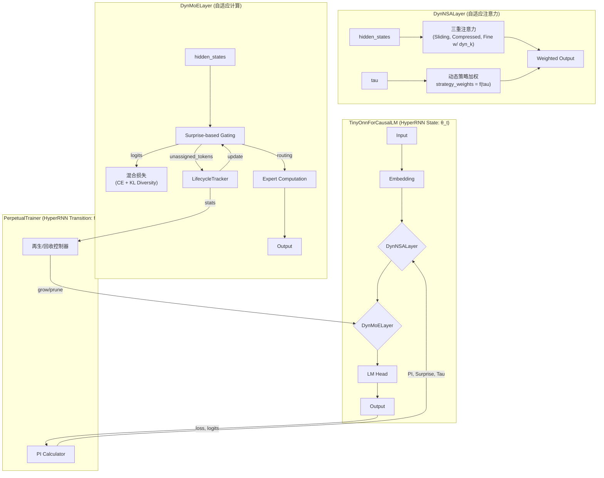

# Tiny-ONN 架构与实现笔记 (v2.0)

## 1. 核心思想：自组织的、永续学习的智能体

回归第一性原理，我们将从一个极简的、随机初始化的“盆景模型”（~0.1B）开始，通过一种模拟有机体发育的“永续预训练”范式，让其成为一个**在有限资源下通过高效信息整合（专家分化/生长/回收 + 动态注意力）来最小化自身变分自由能（VFE）的自组织智能体。**

- **内部状态 (Internal States) - 计算层**: 模型的计算核心由 **DynMoE** 和 **DynNSA** 组成。其统一的学习目标是最小化**预测误差 (`main_loss`)**。
- **马尔可夫毯 (Markov Blanket) - 门控/自适应机制**:
  - **DynMoE Gating**: 负责感知内部状态（`Surprise`）并采取行动（路由决策）。其学习目标是通过一个**混合辅助损失（梯度最小化路由 + 多样性惩罚）**，将信息路由到能以最低“惊奇度”稳定处理它的专家，从而实现效率最大化和自然稀疏性。
  - **DynNSA Adaptation**: 负责感知内部状态（`Tau` / 不确定性）并采取行动（调整注意力策略）。其学习目标是通过一个**混合辅助损失（熵-容量匹配 + 稀疏性压力）**，动态调整三重注意力策略的权重和稀疏度，以在不同困惑度的场景下实现最优的信息整合效率。
- **生长/回收机制**: 模型的**横向宽度（专家数量）**是动态的，且具有**跨生命周期的记忆**。
  - **生长**: 当系统无法有效处理新信息时（体现为存在持续未被路由的 token），它会“生长”出新的专家来专门应对。
  - **回收**: 当一个专家的**生命周期激活率**低于阈值时，它会被回收，以释放计算资源。

## 2. 核心架构：基于模块化组合的 Tiny-ONN

我们坚持**组合优于继承**的原则，从 `PreTrainedModel` 等基础组件开始，构建我们自己的、完全独立的 `TinyOnn` 模型。

## 3. 训练范式与已验证机制

### 3.1. 统一训练循环

经 `exp/smk_poc.py` 和 `exp/DynNSA/` 实验验证，当前**唯一、正确**的训练范式是**统一训练循环**，将所有辅助损失（门控损失、稀疏性损失等）与主损失相加，进行单次联合反向传播。

### 3.2. `DynMoE` 核心机制 (源自 `exp/smk_poc.py`)

- **门控**: 基于 `Surprise`（`main_loss` 对专家输出的梯度范数）的路由。
- **梯度捕获**: 通过 `torch.autograd.grad(main_loss, full_expert_outputs)` 来获取 `per-token-per-expert` 粒度的梯度范数，即 `Surprise` 矩阵。
- **损失函数**: 混合损失 `gating_loss = w_ce * CrossEntropy(logits, argmin(Surprise)) + w_kl * KL_Div(logits, softmax(-Surprise))`。该损失函数已被验证可以有效引导门控进行效率最大化路由，并自然产生稀疏性。
- **专家梯度保护**: 在 `optimizer.step()` 之前，对所有专家的参数梯度进行 `2σ` 离群值过滤，将异常梯度置零。这可以保护专家网络不被少数高难度样本产生的巨大梯度所“污染”，从而稳定学习过程。

### 3.3. `DynNSA` 核心机制 (源自 `exp/DynNSA/`)

- **架构**: 完整的三重注意力策略（滑动窗口、压缩、精细选择）是必须的。
  - **滑动窗口实现**: `local-attention` 库是有效的实现方式，但必须**禁用其内部的旋转位置编码** (`use_rotary_pos_emb=False`) 以避免 `dtype` 冲突。
- **动态 `k` 值**: 可通过一个**混合辅助损失**进行有效引导，该损失包含：
  - **熵-容量匹配**: `MSE(k_ratio, normalized_entropy)`，鼓励模型在困惑时使用更多注意力容量。
  - **稀疏性压力**: `k_ratio.mean()`，鼓励模型在不必要时节约计算资源。

## 4. 生命周期管理与永续学习

- **`LifecycleTracker`**: 这是一个**必须**实现的、独立于模型的组件，用于记录每个专家的生命周期统计数据（如创建时间、总激活次数）。
- **训练范式**: 训练不再以 `epoch` 为单位，而是永续进行。专家的生长和回收将完全基于 `LifecycleTracker` 提供的长期数据，而不是单个批次或 `epoch` 的瞬时数据。

## 5. 观测数据与可视化实施备忘录

### 5.1. 核心理念

所有可视化都应服务于以下核心问题：

- **DynMoE**: 门控是否学会了将信息路由到能产生最低 `Surprise` 的专家？专家网络的功能分化是如何演变的？
- **DynNSA**: 注意力机制的稀疏度 (`avg_k`) 和策略权重是否随着模型的困惑度 (`tau`) 动态变化？
- **系统整体**: 系统的整体“认知健康度”（`PI Score`）是如何演变的？专家生长/回收事件是否与 `PI` 的剧烈变化相关？

### 5.2. 实施方案

使用 `TensorBoard` 进行细粒度数据记录，使用 `Matplotlib` 生成即时概览图表。

#### a. 核心指标定义与计算

| 指标名称 | 计算公式 / 伪代码 | 记录工具 | 描述 |
| :--- | :--- | :--- | :--- |
| **`main_loss`** | `CrossEntropyLoss(outputs.logits, labels)` | TB, Matplotlib | 模型的标准预测损失。 |
| **`moe_gating_loss`** | `w_ce * ce_loss + w_kl * kl_loss` | TB, Matplotlib | `DynMoE` 的混合门控损失。 |
| **`sparsity_attention_loss`** | `w_ent * MSE(k, ent) + w_sparse * k` | TB, Matplotlib | `DynNSA` 的混合稀疏性损失。 |
| **`main_acc`** | `(logits.argmax(-1) == labels).float().mean()` | TB, Matplotlib | 模型的标准预测准确率。 |
| **`gating_acc`** | `(logits.argmax(-1) == surprise.argmin(-1)).float().mean()` | TB, Matplotlib | `DynMoE` 门控路由“正确率”。 |
| **`avg_k`** | `mean(dynamic_k)` | TB, Matplotlib | `DynNSA` 的平均激活块数。 |
| **`surprise`** | `mean(norm(grad(L_main, expert_outputs)))` | TB, Matplotlib | **仅由 `L_main` 产生的**专家参数梯度范数。 |
| **`pi_score`** | `exp(-alpha * (main_loss/tau + gamma*surprise))` | TB, Matplotlib | 预测完整性分数，综合评估模型的“认知健康度”。 |
| **`tau`** | `Categorical(logits=outputs.logits).entropy().mean()` | TB, Matplotlib | 模型输出的平均不确定性（熵）。 |
| **`num_experts`** | `len(model.moe.experts)` | TB | 模型当前的专家总数。 |

#### b. Matplotlib 实时图表规范

`Visualizer` 模块将负责在每个训练步（或每 N 步）结束时，更新并覆盖保存两张图。

**图 1: `core_metrics_latest.png`**

- **布局**: 3x2 的子图面板。
- **内容**:
  1. **Loss**: `main_loss`, `gating_loss`, `sparsity_loss` 的曲线。
  2. **Accuracy**: `main_acc` 和 `gating_acc` 的曲线。
  3. **PI Score**: `pi_score` 的曲线。
  4. **Surprise & Tau**: `surprise` 和 `tau` 的曲线。
  5. **DynNSA Dynamics**: `avg_k` 的曲线。
  6. **Expert Dynamics**: `num_experts` 的曲线。

**图 2: `expert_dashboard_latest.png`**

- **布局**: 2x2 的子图面板。
- **内容**:
  1. **Router Choice Scatter**: 专家激活散点图。Y轴为专家ID，X轴为训练步。
  2. **Lifecycle Activation Rate**: 专家生命周期激活率条形图。Y轴为专家ID，X轴为激活率。
  3. **Router Choice Heatmap**: 专家激活热力图（如果有多数据集）。
  4. **Expert Age**: 专家“年龄”（自创建以来的步数）条形图。

### 4.3. 模块接口

- **`Logger`**: 提供 `log_metrics(metrics_dict)` 方法。
- **`Visualizer`**: 提供 `update_plots(history)` 方法。
