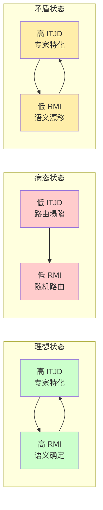
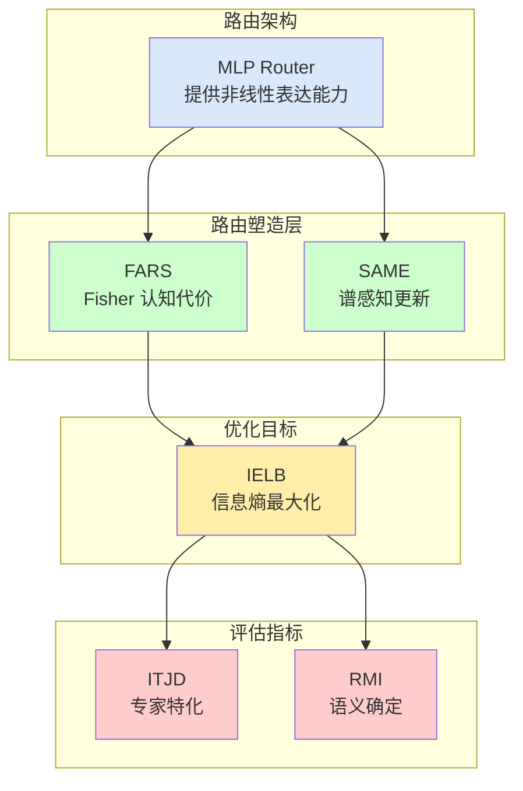

# Routing Theory: MLP 路由与动态稳定性框架

> 版本: 1.0
> 日期: 2026-02-15
> 状态: 理论定型

---

## 目录

1. [核心架构决策: 为什么必须是 MLP 路由](#1-核心架构决策-为什么必须是-mlp-路由)
2. [路由评估指标: ITJD 与 RMI](#2-路由评估指标-itjd-与-rmi)
3. [路由塑造框架: FARS-SAME 协同](#3-路由塑造框架-fars-same-协同)
4. [形式化总结](#4-形式化总结)

---

## 1. 核心架构决策: 为什么必须是 MLP 路由

### 1.1 线性路由的表达能力瓶颈

标准 MoE 广泛采用线性路由（如余弦相似度、点积注意力）:

`w = Softmax(W · x)  # 线性投影 + softmax`

这种线性路由在离散逻辑任务中存在**表达能力瓶颈**:

| 问题类型 | 具体表现 |
|:---|:---|
| **XOR 问题** | 线性分类器无法分离 XOR 决策边界 |
| **多模态语义** | 相似输入可能需要路由到不同专家（如"红色"在"复制"vs"镜像"任务中的不同处理） |
| **上下文依赖** | 路由决策需要整合全局上下文，而非仅基于当前 token 表征 |

### 1.2 MLP 路由的非线性优势

**MLP 路由提供完整的非线性表达能力**:

`w = Softmax(MLP(x)) = Softmax(W₂ · SiLU(W₁ · x + b₁) + b₂)`

对于 ARC 这类离散符号推理任务，路由决策本身就是**逻辑表达**——MLP 路由能够学习复杂的、上下文相关的专家召回策略，这是线性路由无法实现的。

### 1.3 架构-稳定性解耦原则

RDS 路由机制的核心矛盾在于**非线性表达能力**与**动态稳定性**的平衡。最终结论是:

- **路由架构保持简单**: 采用标准的 **MLP 路由器**作为通用非线性函数拟合器
- **稳定性源于外部塑造**: 路由器的稳定性并非其内在属性，而是通过强大的、多层次的**路由塑造策略**在训练动态中强制施加的

我们放弃对复杂路由架构的探索，聚焦于设计和实现一个强大的塑造策略。

---

## 2. 路由评估指标: ITJD 与 RMI

### 2.1 ITJD: Inter-Task Jaccard Distance

**定义**: 任务间路由分布的 Jaccard 距离，衡量专家的**特化程度**。

`ITJD(T₁, T₂) = 1 - |R(T₁) ∩ R(T₂)| / |R(T₁) ∪ R(T₂)|`

其中 `R(T)` 表示任务 `T` 所调用的专家集合。

**物理意义**:

| ITJD 值 | 含义 | 系统状态 |
|:---|:---|:---|
| **≈ 0** | 不同任务调用几乎相同的专家集合 | 路由塌陷，专家无特化 |
| **≈ 1** | 不同任务调用几乎完全不同的专家集合 | 理想特化，专家功能分化清晰 |
| **0.5 左右** | 部分重叠，部分独立 | 过渡状态，需继续训练优化 |

**核心洞察**: ITJD 衡量的是专家系统的"功能分化程度"。高 ITJD 意味着系统成功将不同认知功能分配给不同专家，避免了"万能专家"的低效模式。

### 2.2 RMI: Routing Mutual Information

**定义**: 路由与任务 ID 的互信息，衡量路由决策的**语义确定性**。

`RMI = I(R; T) = Σᵣ Σₜ P(r, t) · log[P(r, t) / (P(r) · P(t))]`

**物理意义**:

| RMI 值 | 含义 | 系统状态 |
|:---|:---|:---|
| **≈ 0** | 路由决策与任务类型无关 | 随机路由，无语义感知 |
| **高值** | 特定任务总是路由到特定专家组合 | 语义确定性高，路由智能 |
| **过高** | 极端特化 | 可能过拟合，泛化能力下降 |

**核心洞察**: RMI 衡量的是路由系统的"语义感知能力"。高 RMI 意味着路由器能够根据输入的语义特征做出确定性的专家选择，而非随机或均匀分配。

### 2.3 两指标的协同解读



| 状态 | ITJD | RMI | 诊断 |
|:---|:---:|:---:|:---|
| **理想** | 高 | 高 | 专家功能分化清晰，路由语义确定 |
| **塌陷** | 低 | 低 | 所有任务调用相同专家，路由无智能 |
| **漂移** | 高 | 低 | 专家功能分化但路由不稳定，同一输入被分配到不同专家 |
| **过拟合** | 低 | 高 | 路由确定但专家功能重叠，可能记忆而非学习 |

---

## 3. 路由塑造框架: FARS-SAME 协同

### 3.1 双漂移问题诊断

MoE 持续学习中的核心挑战:

| 漂移类型 | 定义 | 表现形式 |
|:---|:---|:---|
| **Router Drift** | 路由器参数漂移导致历史输入被重新分配到不同专家 | 相同输入的路由分布随训练演化而改变 |
| **Expert Drift** | 专家自身参数被新任务覆盖，丧失历史功能 | 即使重新训练路由器，专家也无法恢复旧任务性能 |

### 3.2 FARS: Fisher-Aware Routing Shaping

#### 3.2.1 理论基础: IELB

IELB (Information Entropy Load Balancing) 将负载均衡问题重新表述为**概率流形上的信息熵最大化**:

`max H(E) s.t. Σₑ P(e) · Cost(e) ≤ C_budget`

这等价于在**认知预算约束**下的信息熵最大化——系统必须在有限的"总认知代价"下，最优地分配路由概率。

**IELB 是目标，FARS 是实现。**

#### 3.2.2 FARS 机制

利用优化器二阶矩（Fisher 信息近似）量化专家的"认知代价":

`Cost_FARS(e) = ‖√vₑ‖`

其中 `√vₑ` 是 ARS2-Neo 优化器维护的专家参数二阶矩。

**路由塑造信号**:

`𝒢 = Belief · Cost_FARS`

`Belief = P(e|x;φ)`
`Cost_FARS = ‖√vₑ‖`

**总路由损失**:

`ℒ_routing = ℒ_main + λ · (Belief · Cost_FARS)`

**效用-代价平衡**:

- **效用项（∇ᵩ ℒ_main）**: 包含样本特异性，驱动路由器选择对当前样本重要的专家
- **代价项（λ · Cost）**: 提供全局背景阻力，抑制选择认知压力大的专家

### 3.3 SAME: Spectral-Aware Mixture-of-Experts

#### 3.3.1 谱感知路由

**目标**: 解决 Router Drift

**机制**:

1. 维护路由器输入的协方差矩阵:

   `Cₜ = E[xxᵀ]`

2. SVD 分解:

   `Cₜ = UΣVᵀ`

3. 子空间划分:
   - `V∥` (高能量): 当前任务主要变化方向 → **允许更新**
   - `V⊥` (零空间): 历史任务稳定方向 → **保护不变**

4. 梯度投影:

   `ΔW∥ = ΔW_G · V∥ · g(Σ) · V∥ᵀ`
   `ΔW⊥ = ΔW_G · V⊥ · V⊥ᵀ`

**关键洞察**: 在零空间 `V⊥` 中的更新满足 `V⊥ᵀ · x_old ≈ 0`，因此不会改变历史输入的路由决策。

#### 3.3.2 曲率感知缩放

**目标**: 解决 Expert Drift

**机制**:

1. 定义功能退化度量:

   ```
   Δdegrad = E[‖ΔWᵢ · x‖²] = tr(ΔWᵢ · Cₜ₋₁ · ΔWᵢᵀ)
   ```

2. 黎曼梯度下降:

   ```
   ΔWᵢ = -η · ∇L · (Cₜ₋₁)⁻¹
   ```

3. 使用阻尼伪逆近似:

   ```
   (Cₜ₋₁)⁻¹ ≈ Vₖ(Σₖ + μI)⁻¹Vₖᵀ + (1/μ)(I - VₖVₖᵀ)
   ```

**效果**: 抑制沿历史高方差方向的专家更新，保护已被历史任务依赖的参数方向。

### 3.4 FARS-SAME 协同架构



| 组件 | 作用层级 | 解决漂移 | 数学工具 |
|:---|:---|:---|:---|
| **FARS** | 专家选择概率 | Expert Drift | Fisher 信息近似 `√v` |
| **SAME** | 路由器参数更新 | Router Drift | 协方差矩阵谱分解 |

**协同逻辑**:

1. **FARS 提供认知代价信号**: 告诉路由器"哪些专家当前学习压力大"
2. **SAME 提供更新约束**: 告诉路由器"如何在保持历史稳定的前提下学习新知识"
3. **两者共同服务 IELB 目标**: 在认知预算约束下实现信息熵最大化

---

## 4. 形式化总结

### 4.1 完整训练目标

```
ℒ_total = ℒ_main + λ_FARS · ℒ_FARS + λ_SAME · ℒ_SAME

其中:
ℒ_main = CrossEntropy(LMHead(h), y)              # 主任务损失
ℒ_FARS = Σₑ Beliefₑ · Cost_FARS(e)               # 路由塑造损失
ℒ_SAME = ‖ΔW⊥‖²                                  # 谱约束损失（可选）
```

### 4.2 关键符号定义

| 符号 | 定义 | 来源 |
|:---|:---|:---|
| `Cₜ` | 路由器输入的协方差矩阵 | SAME |
| `V∥, V⊥` | 高能量信号子空间与近似零空间 | SAME |
| `g(Σ)` | 奇异值缩放矩阵，`g(Σ) = diag(α₁σ₁, ..., αᵣσᵣ)` | SAME |
| `√vₑ` | 专家参数的 Fisher 信息近似 | FARS |
| `Cost_FARS` | 专家认知代价，`‖√vₑ‖` | FARS |
| `Belief` | 路由器 softmax 输出，`P(e\|x;φ)` | FARS |
| `ITJD` | 任务间 Jaccard 距离，衡量专家特化 | 评估指标 |
| `RMI` | 路由互信息，衡量语义确定性 | 评估指标 |

### 4.3 设计原则

1. **非线性表达**: MLP 路由提供完整的非线性决策边界
2. **稳定性外化**: 通过 FARS-SAME 塑造策略实现动态稳定
3. **信息熵最大化**: IELB 作为统一目标，平衡探索与利用
4. **双漂移解决**: FARS 解决 Expert Drift，SAME 解决 Router Drift

---

## 5. 实验验证: Fisher-Covariance 对偶性

### 5.1 理论假设

FARS 的核心假设是 **优化器二阶矩（Fisher 信息代理）与输入协方差存在对偶关系**：

`exp_avg_sq ≈ diag(Fisher) ∝ diag(C_{t-1})`

这一关系在 ARS2-Neo 中通过 **Energy-Geometry Decoupling** 得到强化：

- **Adam 二阶矩**: 提供能量（步长）信息
- **Muon Newton-Schulz 正交化**: 在几何空间实现满秩 Fisher 近似

理论预期：ARS2-Neo 的 `exp_avg_sq` 比普通 Adam 更好地反映协方差结构。

### 5.2 实验设置

| 配置 | Adam | ARS2-Neo |
|:---|:---:|:---:|
| 输入维度 | 64 | 64 |
| 隐藏维度 | 128 | 128 |
| 学习率 | 1e-3 | 1e-3 |
| Beta2 | 0.999 | 0.95 |
| 训练步数 | 1000 | 1000 |
| 协方差结构 | 4种 | 4种 |

测试协方差结构：

- `diagonal`: 对角协方差，独立特征
- `low_rank`: 低秩结构，冗余特征
- `anisotropic`: 各向异性，特征值指数分布
- `random`: 随机满秩结构

### 5.3 实验结果

| 结构 | Adam 余弦 | ARS2-Neo 余弦 | Adam 相关 | ARS2-Neo 相关 |
|:---|:---:|:---:|:---:|:---:|
| diagonal | 0.9536 | **0.9920** | 0.9012 | **0.9578** |
| low_rank | 0.9618 | **0.9935** | 0.8856 | **0.9307** |
| anisotropic | 0.4486 | **0.9935** | 0.4512 | **0.8954** |
| random | 0.9724 | **0.9949** | 0.9215 | **0.8625** |
| **平均** | 0.8341 | **0.9935** | 0.7899 | **0.9116** |

### 5.4 关键发现

**1. ARS2-Neo 全面优于 Adam**

- 平均余弦相似度：0.9935 vs 0.8341（提升 19%）
- 各向异性结构下提升最显著：0.9935 vs 0.4486（提升 121%）

**2. 各向异性结构的特殊性**

- Adam 在各向异性结构下表现差（0.45），因其对角 Fisher 无法捕捉特征值的长尾分布
- ARS2-Neo 通过 Newton-Schulz 正交化实现满秩近似，在各向异性下仍保持高对齐度

**3. 理论验证**

- 结果支持 ARS2-Neo 的 **Full-rank Fisher Approximation** 理论
- `exp_avg_sq` 可作为 FARS 的可靠认知代价信号

### 5.5 实验脚本

- [`exp/verify_fisher_covariance.py`](exp/verify_fisher_covariance.py): Adam 基线验证
- [`exp/verify_fisher_covariance_ars2neo.py`](exp/verify_fisher_covariance_ars2neo.py): ARS2-Neo 验证

---

*文档版本: 1.1*
*最后更新: 2026-02-21*
