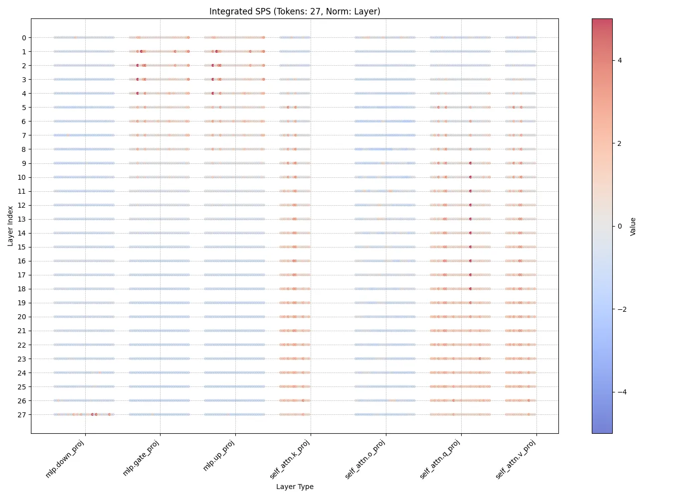
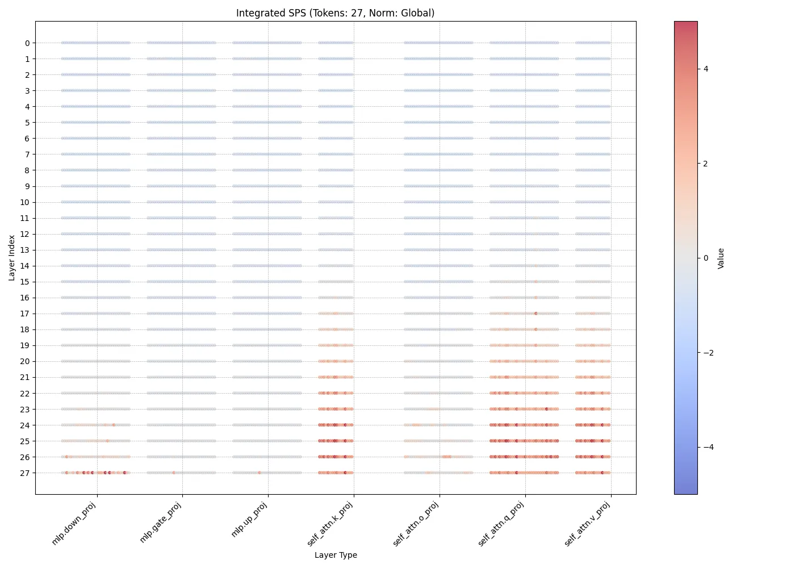

# Tiny-ONN: A New Paradigm for Neural Network Design

[](https://github.com/dmf-archive/IPWT)
[](https://www.gnu.org/licenses/agpl-3.0)
[](./docs/note.md)

> "We are not merging models. We are decomposing one."

---

## What is Tiny-ONN?

**Tiny-ONN (Tiny Ouroboros Neural Network)** is not just another neural network architecture. It is a research project and an engineering endeavor to establish a new paradigm for designing AI systems, moving from "black-box" training to **"white-box" topological reconfiguration**.

Our core hypothesis is that a large, pre-trained dense model is not an inscrutable monolith, but a complex, entangled **functional topology**. Within this high-dimensional space, specialized "conceptual cells" and "functional circuits" have already emerged.

The goal of the Tiny-ONN project is to:

1. **Image (Phase 1):** Develop tools to "see" and map this hidden functional topology.
2. **Reconfigure (Phase 2):** Surgically extract the most critical functional components and rewire them into a new, sparse, efficient, and interpretable Mixture-of-Experts (MoE) architecture.
3. **Evolve (Phase 3):** Implement advanced training strategies (like SMK) to allow this new architecture to learn and adapt with unprecedented efficiency.

This project is built upon the theoretical foundation of **[IPWT (Integrated Predictive Workspace Theory)](https://github.com/dmf-archive/IPWT)**.

## Current Status: Phase 1 - Topological Imaging

We are currently in **Phase 1**. Our primary focus is on building and refining the "scientific instrument" required to perform this topological analysis. We call this instrument our **Digital fMRI Scanner**.

The core of this scanner is the **Integrated Synergistic Prediction Score (`∫SPS`)**, a metric derived from our IPWT framework. `∫SPS` allows us to quantify the functional contribution of every parameter block within a model during a specific task, requiring only a single forward and backward pass. It acts as a "functional density meter," revealing which parts of the model are most critical for a given computation.

### A Glimpse into the Machine's Mind

Below are two preliminary visualizations from a scan of the `Qwen/Qwen3-1.7B` model. These "neuroimages" show the `∫SPS` distribution across all layers, revealing the model's functional hotspots during a task. (`3+5=?`)

| Layer-wise Norm   | Global Norm     |
| :---: | :-----: |
|     | |
| Highlights the relative importance of modules *within* each layer, showing localized functional specialization. | Reveals the absolute "hotspots" across the entire model, identifying globally critical computational cores. |

The raw data for this scan is available for replay and further analysis: [`Qwen--Qwen3-1.7B_20250712_083017.mscan`](./data/scans/Qwen--Qwen3-1.7B_20250712_083017.mscan)

These images, while preliminary, serve as our first proof-of-concept. They demonstrate that functional structures within the model are not random noise; they are **localizable, quantifiable, and structured**. This is the first light we've seen in the black box, and it validates our entire approach.

## The Road Ahead

Our next steps are focused on leveraging these imaging capabilities to tackle the core topological problem:

1. **High-Throughput Scanning:** Automate the scanning process to analyze the model's response to large, specialized datasets (e.g., code, finance, literature).
2. **Topological Data Analysis (TDA):** Apply advanced mathematical tools like **Persistent Homology** and the **Mapper algorithm** to the generated `∫SPS` data. This will allow us to move beyond simple "hotspot" identification to rigorously map out the clusters (Experts) and connections (Functional Circuits) within the model.
3. **Phase 2 Prototyping:** Once we have a clear "functional connectome" of the base model, we will begin the work of Phase 2: designing and building the first prototype of the reconfigured Tiny-ONN architecture.

This is not a short-term project. We are attempting to shift the paradigm from statistical pattern matching to a form of **topological engineering**. We believe this is the only path toward truly understandable, controllable, and scalable artificial general intelligence.

## Installation & Usage

The project is currently in a heavy research and development phase. The primary entry point for experimentation is the `scanner/app.py` Gradio interface, which allows for live fMRI scanning and replay of `.mscan` files.

To set up the environment:

```bash
# It is recommended to use uv for environment management
# https://github.com/astral-sh/uv
uv venv
source .venv/bin/activate
uv sync
```

To run the scanner application:

```bash
# Live scanning mode with a specific model
python scanner/app.py --model Qwen/Qwen3-1.7B

# Replay mode with a pre-existing scan file
python scanner/app.py --mscan_path data/scans/your_scan_file.mscan
```

---

## Citation

If you find our theoretical framework or preliminary tools useful in your research, please consider citing our foundational work:

```bibtex
@misc{ipwt2025,
  author       = {Rui, L.},
  title        = {{Integrated Predictive Workspace Theory: Towards a Unified Framework for the Science of Consciousness}},
  year         = {2025},
  publisher    = {Zenodo},
  doi= {10.5281/zenodo.15676304},
  url= {https://doi.org/10.5281/zenodo.15676304}
}
```

## License

This project is licensed under the AGPLv3 License. See the `LICENSE` file for details.
