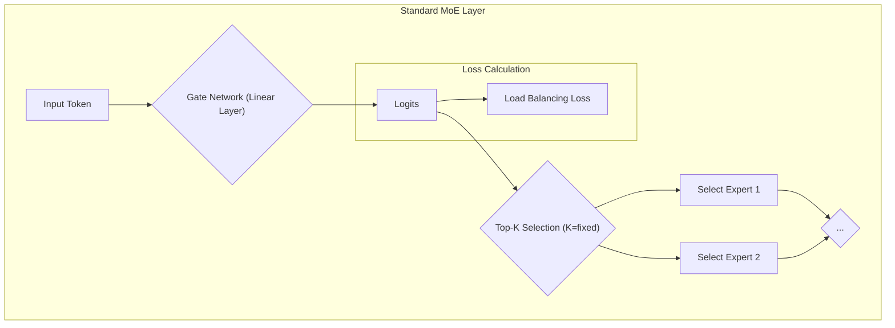
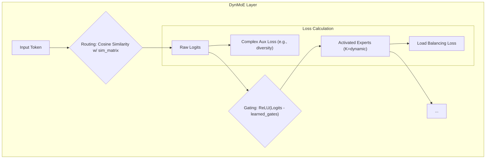

# MoE 架构对比：标准 MoE vs. DynMoE vs. Tiny-ONN

本文档旨在通过 Mermaid 图可视化三种混合专家（MoE）架构在门控和路由机制上的核心差异。

## 1. 标准 MoE (以 Mixtral 为例)

**核心思想**: 固定的 Top-K 路由 + 负载均衡损失。



## 2. DynMoE (参考实现)

**核心思想**: 解耦的路由与门控，通过可学习的阈值实现动态 K。



## 3. Tiny-ONN (我们的设计)

**核心思想**: 解耦的路由与门控 + 基于"学习成本"的元学习损失。

```mermaid
graph TD
    subgraph Tiny-ONN MoE Layer
        A[Input Token] --> B{Routing: Cosine Similarity w/ sim_matrix};
        B --> C[Raw Logits];
        C --> D{"Gating: ReLU(Logits - learned_gates)"};
        D --> E["Activated Experts (K=dynamic)"];
        E --> F[...];
        
        subgraph Meta-Learning Loss Calculation
            C --> G[smk_loss vs. Surprise];
            D --> H[avg_k_loss vs. Target K];
        end
    end