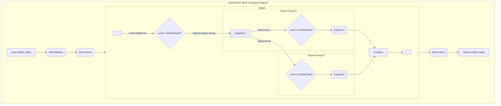

# Tiny-ONN 最终架构方案 (V15.0)

## 1. 核心思想 TL;DR

**通过动态稀疏 MoE 路由物理隔离专家的知识领域，以对抗灾难性遗忘，并通过元学习优化路由策略，最小化内部惊奇（Surprise），从而提高模型的能效比与性能。**

## 2. 核心架构：基于 `GAMoEGateT` 的分层元学习框架

- **Block 内分层**: 在单个 Transformer Block 内部实现两级分层路由，模拟“认知脑区”内的层级化决策。
- **路由机制**: 每一级路由（Level 1 和 Level 2）都采用 `GAMoEGateT` 模块。该机制是高斯路由的一个工程优化版本，通过计算输入与专家原型向量的余弦相似度，并与一个可学习的阈值比较，来实现动态数量的专家激活。

## 3. 训练范式：解耦的元学习 (快思慢想)

训练流程被明确地分为两个解耦的阶段，分别优化专家和门控。

### 3.1 专家学习 (快系统)

此阶段的目标是让专家网络最小化预测误差。

1. **状态设定**: 门控网络（Router）参数被冻结 (`requires_grad=False`)。
2. **前向传播**: 输入批次通过模型，门控根据当前策略进行路由，计算出最终的 `logits`。
3. **专家更新**:
   - 根据 `logits` 计算主损失 `L_main` (交叉熵)。
   - 执行 `L_main.backward()`。由于门控被冻结，只有被选中的专家会接收到梯度。
   - `optimizer_experts.step()` 更新专家权重。
4. **经验提取与缓存**:
   - 在 `backward` 过程中，通过 `functorch` 或 `hooks` 拦截并计算出每个 Token 在其被路由到的专家上产生的**梯度范数 (Surprise)**。
   - 将包含以下信息的经验元组缓存下来，供门控学习使用：
     - `token_hidden_state`: 输入到当前 MoE 层的隐状态。
     - `router_logits`: 门控对该 Token 输出的原始 logits。
     - `per_expert_grad_norms`: 该 Token 在**所有**专家上潜在的梯度范数（作为真值来源）。

### 3.2 门控学习 (慢系统)

此阶段的目标是让门控网络学会预测并选择能产生最小“内部惊奇”的路由路径。

1. **状态设定**: 专家网络参数被冻结。
2. **数据准备**: 从之前步骤缓存的经验中获取一批训练数据。
3. **真值计算**: 对于每一个样本，通过对缓存的 `per_expert_grad_norms` 向量取 `argmin()`，找到能产生最小 Surprise 的**最优专家路径 (`optimal_path`)**。
4. **门控更新**:
   - 使用缓存的 `router_logits` 作为预测值。
   - 计算门控损失 `L_router = CrossEntropyLoss(router_logits, optimal_path)`。
   - 执行 `L_router.backward()`。
   - `optimizer_router.step()` 更新门控权重。

## 4. PoC 阶段关键实现说明

- **单 GPU**: 暂时不考虑分布式训练，所有实现均在单 GPU 环境下进行。
- **计算效率**: 严格遵循“一次前向，两次不重叠反向传播”的原则，复用计算结果，避免重复计算。
- **Per-Token 梯度**: 获取 per-token 级别的梯度范数是本框架的技术核心，将优先采用 `functorch` 方案进行实现。

## 5. Tiny-ONN (V15.0) 与 DynMoE：创新点对比分析

我们的 `Tiny-ONN` 框架并非对 `DynMoE` 的简单复制，而是在其优秀工程实践的基础上，进行了**架构、训练范式和理论目标**上的根本性创新。

#### **共同基础与继承**

我们继承了 `DynMoE` 最为优秀的几个方面：

- **`GAMoEGateT` 路由机制**: 我们采纳了 `DynMoE` 中 `GAMoEGateT` 的核心思想，即使用原型向量和动态阈值进行路由。这比传统的高斯路由更简洁、更易优化，并能实现动态数量的专家激活。
- **动态数量专家激活**: 保持了根据输入自适应激活不同数量专家的灵活性，有助于提高能效比。

#### **核心创新点**

我们的创新主要体现在以下三个层面：

1. **架构创新：认知流水线中的分层路由 (Intra-Block Hierarchical Routing)**

   - **DynMoE**: 采用扁平化的 MoE 结构，所有专家处于同一层级。
   - **Tiny-ONN (V15.0)**: 在单个 Transformer Block 内部实现了**两级分层路由**。Level 1 Router 选择专家组，Level 2 Router 在组内选择具体专家。这种“脑区内的分层决策”模拟了更复杂的认知处理过程，旨在实现更细粒度、更专业的知识领域划分。

2. **训练范式创新：解耦的元学习 (Decoupled Meta-Learning)**

   - **DynMoE**: 采用传统的端到端训练，门控和专家在同一个反向传播和优化循环中更新。辅助损失直接加到主损失上，共同优化。
   - **Tiny-ONN (V15.0)**: 引入了**双循环解耦训练**范式，将专家和门控的优化过程分离：
     - **专家学习 (快系统)**: 专家网络在门控冻结的情况下，根据主任务（交叉熵）进行训练。
     - **门控学习 (慢系统)**: 门控网络在专家冻结的情况下，通过**元学习**的方式进行训练。它学习如何根据输入特征，预测并选择能产生最小“内部惊奇”（即最低梯度范数）的路由路径。
     - **计算效率**: 采用“一次前向，两次不重叠反向传播”的策略，确保了这种解耦训练的高效性。

3. **学习信号与理论目标创新：最小化内部惊奇驱动功能分化**
   - **DynMoE**: 门控的辅助损失主要关注负载均衡和稀疏性（通过直接惩罚门控输出总量）。它的目标是工程上的效率和均衡。
   - **Tiny-ONN (V15.0)**: 门控的学习目标直接与 IPWT（整合预测工作空间理论）的核心概念——**最小化内部惊奇**挂钩。门控的监督信号不再是简单的辅助损失，而是：
     - **基于真实梯度的“最优路径”**: 通过 `functorch` 等技术，精确获取每个 Token 在所有潜在专家上产生的真实梯度范数。
     - **“物理隔离”的功能分化**: 门控的学习目标是**学会将不同的 Token 路由到那些能够以最低学习成本（最小梯度范数）处理它们的专家**。这种机制在架构层面就强制了专家知识领域的“物理隔离”和功能分化，从而更有效地对抗灾难性遗忘，并实现更高的能效比。

#### **总结**

`DynMoE` 在动态路由和工程优化方面是卓越的。而 `Tiny-ONN` 则在其基础上，通过引入**认知启发的架构分层**、**创新的解耦元学习训练范式**，以及**直接将理论中的“最小化内部惊奇”作为门控学习的核心目标**，实现了更深层次的智能涌现和功能分化，从而更直接地服务于对抗灾难性遗忘和提高能效比的最终目标。

这种“学生”与“导师”般的训练关系，使得 `Tiny-ONN` 不仅仅是一个高效的 MoE 模型，更是一个能够**自主学习如何更高效地学习**的元学习系统。
