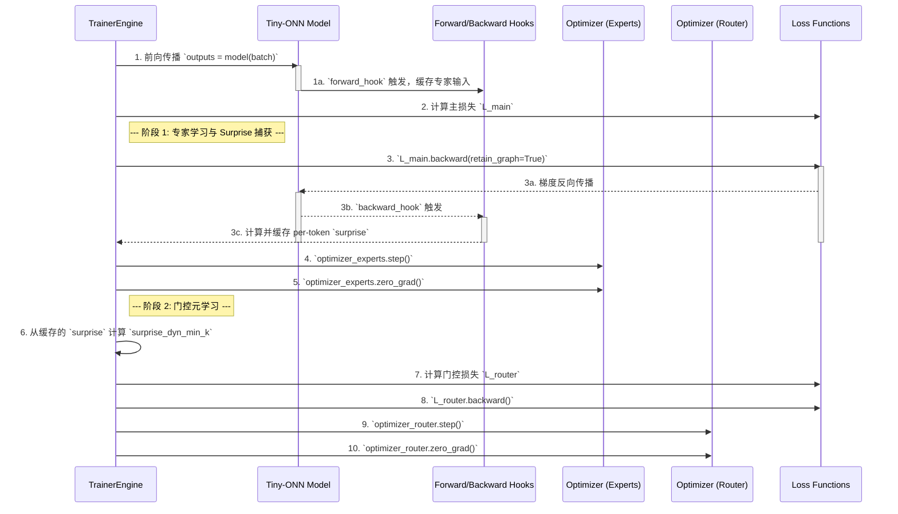

# DevLog: 训练循环实施备忘录 (最终版)

## 1. 核心问题与最终决策

我们的核心挑战是在实现“解耦元学习”的同时，保证代码的稳定性、可维护性和对 PyTorch 机制的正确利用。

经过对 `torch.autograd.grad` 方案和 `exp` 目录中基于 `backward_hook` 的方案进行深入权衡，我们做出最终决策：

**采纳基于 `backward_hook` 和两次独立 `backward()` 调用的实施策略。**

该方案被选中的核心理由是：
- **稳定性与可靠性**: 它完全基于 PyTorch 成熟的 `hook` 机制，该机制已在我们的 `exp` 目录中得到充分验证，出错风险远低于复杂的 `autograd.grad` 操作。
- **概念清晰度**: 将专家学习和门控元学习分为两个独立的 `backward` 过程，虽然计算上是两步，但在逻辑上完美地映射了理论中的“解耦”思想。
- **指标纯粹性**: 通过在 `L_main.backward()` 之后立即捕获梯度，我们确保了计算出的 `surprise` 指标**完全不受**后续 `L_router` 梯度的任何影响。

## 2. 最终实施策略：两次 `backward` 方案

`TrainerEngine` 的核心 `train_step` 方法将严格遵循以下顺序，该顺序定义了我们的 "Hyper Step"。

### Hyper Step 流程图

### 3. 关键实现细节

- **`retain_graph=True`**: 在 `L_main.backward()` 中使用此参数是至关重要的，它会保留计算图，使得后续的 `L_router.backward()` 能够成功执行。
- **两个优化器**: 我们将实例化两个独立的 `Adam` 优化器。
  - `optimizer_experts`: 包含模型中**除门控层之外**的所有参数。
  - `optimizer_router`: **只包含**门控层的参数。
  这样可以确保 `optimizer_router.step()` 只更新门控权重。
- **`GradientInterceptor` 类**: 我们将把 `exp/grad_hook_poc` 中的 `GradientInterceptor` 类正式化，并将其作为 `training/hooks.py` 模块的核心，负责 `surprise` 的计算和缓存。

## 4. 结论

此方案是理论稳健性与工程实践可靠性的最佳结合。它直接采用了项目中已验证的技术，保证了核心指标的纯粹性，并为后续的调试和扩展提供了清晰的逻辑框架。这将是我们训练引擎实现的最终指导方针。