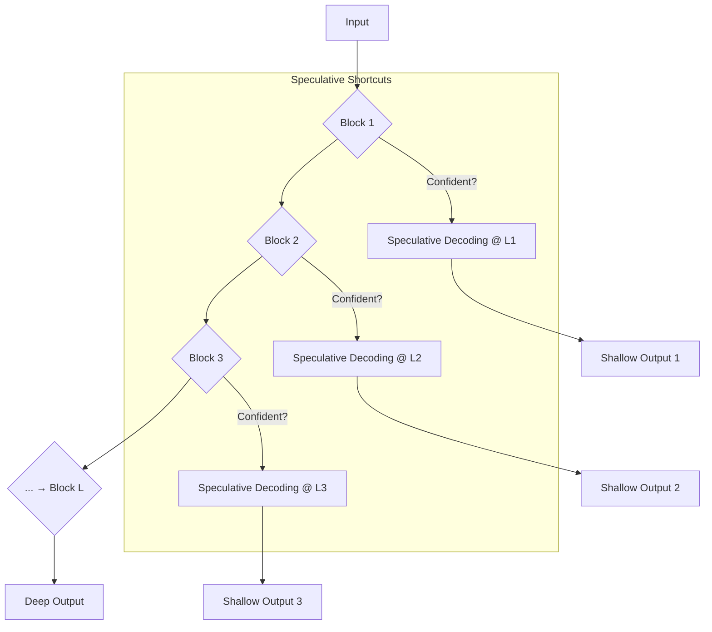

## 1. 背景：超越固定深度的计算

传统的神经网络，无论其架构多深，其推理过程在本质上是静态的：每一个输入都必须完整地流经所有层级，完成一次固定成本的前向传播。这与生物智能形成了鲜明对比——生物系统能够根据任务的熟悉度和复杂度，动态地调动计算资源，在快速的“条件反射”和缓慢的“深思熟虑”之间无缝切换。

本文旨在形式化一个全新的推理范式——**自适应深度推理 (Adaptive Depth Inference, ADI)**。它融合了**分层递归循环**与**块级投机性解码 (Block-level Speculative Decoding)**，旨在构建一个计算深度自适应的神经网络架构。

## 2. 核心构想：从分层循环到动态捷径

我们的起点是**分层投机性解码**，它利用模型内在的快慢计算路径（如 TRM 中的内外循环）来实现“自产自销”的解码加速。然而，该模型依然受限于一个预设的、固定的分层结构。

**自适应深度推理 (ADI)** 的核心革新在于打破这一固定结构，允许在 Transformer 架构的**任意层级**动态地“踢出 (kick off)”一个投机性解码过程。

### 2.1. 形式化定义

**自适应深度推理 (ADI)** 是一种推理策略，它允许模型在标准的前向传播过程中，根据每一层的内部状态（如不确定性、激活稀疏度等），动态决定是继续进行更深层次的计算，还是**立即**基于当前层的表征启动一个投机性解码循环。

这意味着，模型不再需要总是完成一次完整的、从输入到输出的深层前向传播。对于“熟悉”或“简单”的输入，模型可能仅用浅层网络的表征就足以生成高质量的预测。

### 2.2. 计算流程比较

**标准 Transformer (深思熟虑)**:
  `Input → Block 1 → Block 2 → ... → Block L → Output`
  （总是走完全程）

**ADI Transformer (自适应深度)**:

对于一个给定的输入，如果第二层 (`Block 2`) 的状态已经足够“自信”，系统可以直接利用 `Block 2` 的输出启动一个廉价的投机性解码循环，而无需再花费成本计算 `Block 3` 到 `Block L`。

## 3. 关键机制：置信度驱动的提前退出

实现 ADI 的关键在于一个可靠的、计算上廉价的“置信度度量 (Confidence Metric)”或“提前退出触发器 (Early-Exit Trigger)”。这个触发器在每个块的末端被评估，以决定是否“踢出”解码。

理论上，这个度量可以有多种形式，其选择与我们的核心理论紧密相连：

1. **预测熵 (Predictive Entropy)**: 在每个块后附加一个轻量级的 `LM Head`，计算下一个 `token` 预测的熵。低熵（即预测非常确定）是提前退出的强烈信号。
2. **激活稀疏度 (Activation Sparsity)**: 在我们的 `SPL/SARS` 架构中，一个高度稀疏的激活模式意味着模型已经为当前输入找到了一个非常特定的、专门化的“概念通路”。这种高稀疏度可以作为置信度的代理指标。
3. **表征稳定性 (Representation Stability)**: 比较连续两个块 (`Block_i` 和 `Block_i+1`) 输出表征的余弦相似度。如果表征已经稳定（相似度高），则意味着更深层次的计算可能只会带来边际改进，可以提前退出。

## 4. 理论意义：一个能形成“计算习惯”的架构

ADI 范式将赋予 `Tiny-ONN` 一系列革命性的能力，使其在计算行为上更接近生物智能：

1. **自适应计算成本**: 推理成本与任务难度直接相关。对于简单、重复的任务，模型自动采取“计算捷径”，实现极低的延迟和能耗。对于复杂、新颖的任务，模型则自动投入全部计算资源进行“深度思考”。
2. **涌现的条件反射**: 通过训练，模型将学会哪些模式可以在浅层网络中被可靠地处理。这种“浅层处理”在功能上等价于生物的**条件反射 (Conditioned Reflex)**——一种快速、自动、低功耗的响应模式。它不是被硬编码的，而是在最小化系统总计算成本（或自由能）的压力下**涌现**出来的。
3. **分层的世界模型**: 不同深度的“提前退出”点，在功能上对应了模型在不同抽象层次上构建的世界模型。浅层网络处理具体的、局部的模式，而深层网络则处理抽象的、全局的因果关系。ADI 使得模型可以根据需要在这些不同层次的表征之间动态切换。
4. **对 `IPWT` 的动态诠释**: ADI 完美地诠释了 `IPWT` 中“效率压力塑造认知”的核心思想。系统为了在宏观上最小化其变分自由能（即以最低成本做出最准确的预测），自发地演化出了“计算习惯”。“习惯成自然”不再是一个比喻，而是一个可被形式化描述和工程实现的计算过程。

## 5. 结论：从静态巨人到敏捷思考者

自适应深度推理 (ADI) 是对当前主流深度学习推理范式的一次根本性挑战。它将神经网络从一个必须“全力以赴”的静态巨人，转变为一个能够根据情境动态分配认知资源的敏捷思考者。

这一理论构想为 `Tiny-ONN` 的未来发展指明了一个清晰而激动人心的方向。虽然具体实施（如设计最优的置信度度量、训练策略等）将面临诸多挑战，但其理论回报是巨大的：一个真正意义上具有自适应计算能力、能够形成“计算习惯”的、更高效、更智能的神经网络。
