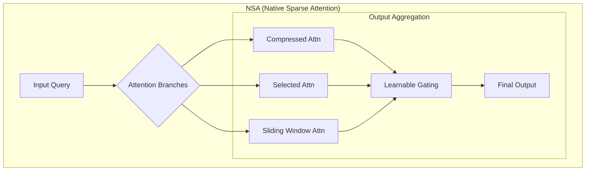

### 全栈稀疏化技术选型报告：为 Tiny-ONN 项目选择下一代稀疏化方案

#### 1. 摘要与核心目标

本报告旨在为 Tiny-ONN 项目的下一战略阶段——**全栈稀疏化 (Full-Stack Sparsity)**——提供技术选型依据。在成功验证了基于`Surprise`的动态稀疏 MoE (DynMoE) 方案，解决了 FFN 层的稀疏化问题后，我们的目标是将稀疏化理念推广至模型的每一个核心组件，特别是**输入嵌入层**和**注意力机制**。本次调研的核心任务是，系统性地梳理前沿的稀疏化技术，并最终**选择一个具体的、开源的、与我们项目理念高度契合的参考实现**，作为下一阶段开发的“脚手架”。

#### 2. 调研方向与核心发现

##### 2.1. 方向一：稀疏嵌入层 (Sparse Embedding)

**2.1.1. 核心发现：RWKV-8 `DeepEmbed`**

通过对公开资料的研究，我们确认 RWKV-8 架构中的 `DeepEmbed` 技术与我们内部构想的 `Sparse-Addressing MoE` 在核心思想上高度一致，这极大地验证了我们方向的前沿性。

- **技术原理**: `DeepEmbed` 的核心是**为词表中的每一个 token，在模型的每一层都学习一个独立的可训练向量**。这个向量并不直接替换 FFN 层的权重，而是在推理时，根据当前 token 的 ID 从一个巨大的、可存储在 RAM/SSD 的“知识库”中被提取出来，用于对该 FFN 层的输出进行**逐通道的乘性调制 (channel-wise scaling)**。

- **核心优势**:

  1. **极致的内存效率**: `DeepEmbed` 的参数矩阵 (`[num_layers, vocab_size, ffn_hidden_size]`) 规模庞大，但在推理时，每个 token 在每一层仅需加载其对应的那个小向量。这使得它几乎不占用显存（zero VRAM overhead），完美契合端侧部署和超大规模模型的设想。
  2. **稀疏知识库**: 它将一个巨大的静态 `nn.Embedding` 查找表，转化为一个庞大但可稀疏访问的“知识库”，使得模型能够存储和调用更丰富的世界知识。
  3. **与 Tiny-ONN 理念契合**: 这种“按需计算”和“动态调制”的思想，与我们基于 FEP（自由能原理）构建自组织智能体的理念不谋而合。`DeepEmbed` 可以被视为一种结构化的先验知识，指导着 FFN 层的动态信息处理。

- **实现分析**: `rwkv_v8_rc00_demo.py` 中的示例代码展示了其实现的简洁性：

  ```python
  # DeepEmbed_1x ReLuSq FFN:
  self.deepemb = nn.Embedding(d_vocab, d_emb)
  # ...
  x = torch.relu(self.key(x)) ** 2
  return self.value(x) * self.deepemb(idx)
  ```

  这表明，其核心是在现有计算流中引入一个乘性门控，实现起来相对直接。关键在于训练过程中的参数管理和 offload 策略。

**2.1.2. 市场现状**

我们的调研证实，直接用计算过程替换整个 `nn.Embedding` 层的研究在主流 Transformer 架构中仍然相对较少。这表明，我们的 `Sparse-Addressing MoE` 和 `DeepEmbed` 所代表的方向，是一个具有高度创新潜力的领域。

### 2.2. 方向二：稀疏注意力 (Sparse Attention) - 技术选型：NSA

#### a. NSA 核心技术解析

`Native Sparse Attention (NSA)` 是一种与现代硬件（GPU）架构深度对齐、并可实现端到端原生训练的稀疏注意力机制。它放弃了单一稀疏模式，通过三种并行且互补的注意力分支，实现了对长下文的高效建模。

##### 架构概览

NSA 的核心思想是通过一个动态分层的稀疏策略，将对 Key/Value 的处理分解为三个并行路径，其输出通过一个可学习的门控机制进行加权融合。



##### 核心组件详解

- **压缩注意力 (Compressed Attention)**
  - **目标**: 捕获粗粒度的全局上下文信息。
  - **实现**: 将序列中的 Key/Value 划分为连续的块（block），并使用一个可学习的 MLP ( `φ` ) 将每个块压缩成一个单一的、代表性的 Key/Value 向量。这极大地降低了参与注意力计算的单元数量。
  - **公式**: `K_comp = {φ(k_block_i)}`

- **选择性注意力 (Selected Attention)**
  - **目标**: 聚焦于重要的、细粒度的局部信息。
  - **实现**: 这是一个两阶段过程：
    1. **重要性评分**: **复用**“压缩注意力”分支中计算出的注意力权重 (`p_comp`) 作为块级别的重要性分数。这个设计极为巧妙，避免了为选择过程引入额外的、难以训练的计算开销。
    2. **Top-n 选择**: 根据聚合后的重要性分数，选择得分最高的 `n` 个原始 Key/Value 块，保留其完整的、未经压缩的细粒度信息。
  - **核心优势**: 实现了硬件友好的块状（Blockwise）数据读取，避免了随机、零散的内存访问，这是其实现高性能的关键。

- **滑动窗口注意力 (Sliding Window Attention)**
  - **目标**: 高效处理局部上下文，并防止其主导学习过程。
  - **实现**: 维持一个固定大小的窗口（例如 `w=512`），只计算 Query 与最近的 `w` 个 Key/Value 之间的注意力。
  - **作用**: 通过设立专门的分支处理局部信息，可以将“压缩”和“选择”两个分支解放出来，使其更专注于学习长距离依赖关系，避免了“捷径学习”（Shortcut Learning）。

#### b. 硬件对齐与内核设计

NSA 的卓越性能不仅来自算法创新，更源于其对现代 GPU 硬件特性的深刻理解和优化。

- **核心挑战**: 如何在稀疏访问模式下，依然保持类似 `FlashAttention` 的高算术强度（Arithmetic Intensity）。
- **解决方案**: 提出了一个 **“以组为中心 (Group-Centric)”** 的 Triton 内核设计。
  - **数据加载**: 针对 GQA/MQA 架构，一次性加载一个组（Group）内的所有 Query 头，因为它们共享相同的稀疏 KV 块索引。
  - **内存访问**: 顺序加载被选中的、连续的 KV 块到 SRAM 中，最大化内存访问效率。
  - **调度优化**: 将 Query 循环置于 Triton 的网格调度器（grid scheduler）中，简化了内核并平衡了计算负载。

#### 4. 整合计划与下一阶段展望

我们将 NSA 的思想整合到 Tiny-ONN 项目中，以实现全栈稀疏化。

| 步骤 | 描述 | 目标 |
| :--- | :--- | :--- |
| **1. 原型复现** | 在 `exp/` 目录下，基于论文伪代码初步复现 NSA 核心逻辑，特别是三个并行分支。 | 验证对算法的理解，打通核心计算流程。 |
| **2. 模块化封装** | 将复现的 NSA 逻辑封装成一个独立的 `nn.Module`，接口与现有 Attention 模块兼容。 | 创建一个可重用、可测试的 `NativeSparseAttention` 模块。 |
| **3. 整合与测试** | 在 `tiny_onn/modular.py` 中，用 `NSA` 模块替换标准 `Attention` 模块。 | 将新技术无缝集成到核心模型架构中。 |
| **4. 性能基准测试**| 在我们的训练框架下，对集成了 NSA 的模型进行训练，并与全注意力基线对比性能和效率。 | 量化 NSA 在我们特定场景下的真实收益。 |

通过整合 NSA，我们不仅解决了注意力瓶颈，更重要的是，其“分层、分治”的设计哲学与我们基于 FEP 理论构建自组织智能体的目标高度契合。NSA 的不同分支可被视为模型在不同抽象层次上对预测误差进行最小化的具体实现，为我们下一阶段的探索提供了坚实的工程基础和理论启发。
